# Analytics Reference Handbook

> The canonical analytics knowledge base for engineers, product managers, QA engineers, designers, and data analysts.
>
> **Version:** 1.0
> **Status:** Living document
> **Audience:** Junior developers through senior architects

This document is intended to be detailed enough that any developer can understand analytics concepts, implement tracking correctly, debug issues, and make future analytics decisions without needing external documentation.

---

## Table of Contents

1. [Introduction](#1-introduction)
2. [Core Analytics Terminology](#2-core-analytics-terminology)
3. [How Analytics Works](#3-how-analytics-works)
4. [Event Lifecycle](#4-event-lifecycle)
5. [Attribution Models](#5-attribution-models)
6. [Industry Standards](#6-industry-standards)
7. [Analytics Naming Conventions](#7-analytics-naming-conventions)
8. [Event Design Best Practices](#8-event-design-best-practices)
9. [User Identification](#9-user-identification)
10. [Sessions](#10-sessions)
11. [Funnels](#11-funnels)
12. [Cohorts](#12-cohorts)
13. [Retention](#13-retention)
14. [Common Metrics](#14-common-metrics)
15. [Event Taxonomy](#15-event-taxonomy)
16. [Data Quality](#16-data-quality)
17. [Privacy and Compliance](#17-privacy-and-compliance)
18. [Implementation Best Practices](#18-implementation-best-practices)
19. [Debugging Analytics](#19-debugging-analytics)
20. [Real Project Examples](#20-real-project-examples)
21. [Our Analytics Standards](#21-our-analytics-standards)
22. [Developer Checklist](#22-developer-checklist)
23. [FAQ](#23-faq)
24. [Appendix](#24-appendix)

---

### How to read this document

| If you are a... | Start here |
|---|---|
| Junior developer | [Sections 1-4](#1-introduction), then [7-10](#7-analytics-naming-conventions) |
| Senior engineer / architect | [Sections 3-6](#3-how-analytics-works), [15-18](#15-event-taxonomy) |
| Product manager | [Sections 1, 5, 11-14](#1-introduction) |
| QA engineer | [Sections 16, 19, 22](#16-data-quality) |
| Data analyst | [Sections 5, 12-14, 16](#5-attribution-models) |
| Designer | [Sections 1, 2, 11](#1-introduction) |

> **Callout legend used throughout this document**
>
> - ✅ **Best Practice** - the recommended way to do something
> - ⚠️ **Common Pitfall** - a mistake people repeatedly make
> - 💡 **Pro Tip** - an expert shortcut or nuance
> - 📌 **Important Note** - something you must not miss
> - 🧪 **Example** - a concrete, practical illustration

---

## 1. Introduction

### 1.1 What is analytics?

**Analytics** is the systematic discipline of collecting, measuring, and interpreting data about how people interact with a product or business, in order to make better decisions.

At its simplest, analytics answers four families of questions:

| Question family | Example | What it tells you |
|---|---|---|
| **What happened?** | "How many users signed up last week?" | Descriptive analytics |
| **Why did it happen?** | "Why did signups drop on Tuesday?" | Diagnostic analytics |
| **What will happen?** | "How many users will renew next month?" | Predictive analytics |
| **What should we do?** | "Which feature should we build next?" | Prescriptive analytics |

Analytics is not a single tool or dashboard. It is a pipeline that begins with a real human action and ends with a human decision.

### 1.2 Why product analytics matters

Without analytics, product teams operate on opinion, memory, and the loudest voice in the room. With analytics, teams operate on evidence.

Concretely, product analytics lets you:

- Discover where users get stuck (drop-off in funnels).
- Quantify the impact of a feature or experiment.
- Prioritize the roadmap by data instead of guesswork.
- Detect regressions (a sudden drop in conversions after a release).
- Understand which acquisition channels actually produce valuable users.
- Forecast revenue and retention.

> 📌 **Important Note:** Analytics is a decision-support system, not a vanity scoreboard. Every metric you track should connect to a decision someone could make. If no decision depends on a number, you probably should not be spending engineering effort to track it.

### 1.3 Business analytics vs product analytics

These two disciplines overlap but answer different questions for different audiences.

| Dimension | Business Analytics | Product Analytics |
|---|---|---|
| **Primary question** | "Is the company healthy and growing?" | "How do users behave inside the product?" |
| **Typical metrics** | Revenue, MRR, ARR, CAC, LTV, margin | Feature adoption, funnel conversion, retention, session depth |
| **Granularity** | Aggregate, financial | Event-level, behavioral |
| **Primary audience** | Executives, finance, sales | Product managers, engineers, designers |
| **Time horizon** | Quarterly, annual | Daily, weekly, per-release |
| **Typical tools** | Looker, Tableau, Power BI, spreadsheets | Mixpanel, Amplitude, PostHog, GA4 |
| **Source data** | Billing, CRM, ERP, finance systems | Event streams from apps and websites |

> 🧪 **Example:** Business analytics tells you "revenue grew 8% this quarter." Product analytics tells you "the onboarding checklist feature increased week-1 retention from 34% to 41%, which is what drove the revenue growth." The first describes the outcome; the second explains the mechanism.

### 1.4 Why event tracking is important

An **event** is a record that "something happened" at a point in time, performed by someone, with context attached. Event tracking is the foundation that everything else in this document depends on.

Why events (rather than just page counts) matter:

- **Events are composable.** From a stream of granular events you can later compute funnels, retention, cohorts, and revenue. You cannot go the other way: aggregate counters cannot be decomposed into the behavior that produced them.
- **Events are future-proof.** You may not know today what question you will ask in six months. A well-designed event stream lets you answer questions you have not thought of yet.
- **Events carry context.** Each event can carry properties (which button, which plan, how much) that make later analysis rich.

> ⚠️ **Common Pitfall:** Teams often start by tracking only top-line counters ("total signups") and discover months later that they cannot answer "which channel did those signups come from?" because the context was never captured at event time. Capture context when the event happens; you cannot reconstruct it afterward.

### 1.5 How analytics drives product decisions

The decision loop looks like this:

1. **Hypothesis:** "We believe shortening signup to one step will increase conversion."
2. **Instrumentation:** Add events for each signup step.
3. **Measurement:** Observe the funnel before and after the change.
4. **Decision:** Keep, revert, or iterate based on the measured effect.

This is a continuous loop, not a one-time project.

### 1.6 The analytics lifecycle

Every piece of analytics data travels through the same lifecycle, from a human action to a human decision:

```
User Action
  → Event Generated
    → SDK
      → Data Collection
        → Processing
          → Attribution
            → Warehouse
              → Dashboard
                → Decision Making
```

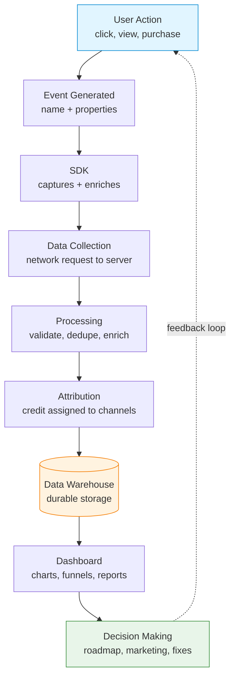

| Stage | What happens | Who/what owns it |
|---|---|---|
| User Action | A human does something | The user |
| Event Generated | Code decides "this is worth recording" | Application developer |
| SDK | Library captures the event and attaches context | Analytics SDK |
| Data Collection | Event is sent over the network | SDK + ingestion API |
| Processing | Validation, deduplication, enrichment | Analytics platform |
| Attribution | Conversions are credited to marketing touches | Attribution engine |
| Warehouse | Data is stored durably for querying | Data warehouse |
| Dashboard | Humans view aggregated results | BI / analytics tool |
| Decision Making | A human acts on what they see | Product, marketing, eng |

> 💡 **Pro Tip:** When debugging "the number looks wrong," walk this lifecycle from left to right. The bug is almost always at a specific stage (event never generated, SDK dropped it, network failed, deduplication removed it, attribution credited the wrong channel). Knowing the stages turns a vague "analytics is broken" into a precise diagnosis. See [Section 19](#19-debugging-analytics).

---

## 2. Core Analytics Terminology

This is the shared vocabulary for the rest of the document. For each term you get a definition, why it matters, an example, and common mistakes. A condensed A-Z version lives in the [Appendix](#241-complete-glossary-a-z).

### 2.1 User concepts

#### Anonymous user

- **Definition:** A user whose real identity is unknown to your system. Tracked only by a device or browser identifier, not a user ID.
- **Why it matters:** Most visitors are anonymous before they sign up. If you cannot track anonymous users, you lose the entire pre-signup journey (which channel brought them, what they browsed).
- **Example:** A first-time visitor browsing your pricing page. You know `device_id: d-9f2a...` but not who they are.
- **Common mistakes:** Treating each anonymous visit as a brand-new user, inflating your user counts. Anonymous identity must persist across visits via a stable device/cookie ID.

#### Identified user

- **Definition:** A user you have linked to a known identity (a `user_id`) via an explicit `identify` call.
- **Why it matters:** Identification is what lets you connect pre-signup anonymous behavior to post-signup behavior, and stitch the same person across devices.
- **Example:** After login, you call `identify("user_123")`, linking the anonymous device to that account.
- **Common mistakes:** Calling `identify` with a value that is not stable (e.g. an email that can change) instead of an immutable internal ID.

#### Logged-in user

- **Definition:** A user with an active authenticated session right now.
- **Why it matters:** Distinguishes current authenticated state from "we know who this is in general." A user can be identified (we know them) but logged out (no active session).
- **Example:** A user who entered credentials and currently holds a valid session token.
- **Common mistakes:** Conflating "logged in" with "identified." See the comparison below.

> 📌 **Important Note - these are not the same thing:**
>
> | Term | Meaning | Can be true while logged out? |
> |---|---|---|
> | Anonymous | Identity unknown | Yes |
> | Identified | We have linked a `user_id` to this device | Yes (you can still know who they are after logout) |
> | Logged-in | Active authenticated session now | No |

#### User ID

- **Definition:** A stable, unique identifier assigned by *your* system to a person/account.
- **Why it matters:** It is the primary key that ties together all of a person's behavior across devices and time.
- **Example:** `user_id: "usr_8c1e0b"`.
- **Common mistakes:** Using email, phone, or username as the user ID. These are personally identifiable, can change, and may be shared. Use an opaque internal ID.

#### Device ID

- **Definition:** A unique identifier for a specific device or browser, usually generated by the SDK and stored in a cookie, local storage, or device storage.
- **Why it matters:** It is how anonymous users are tracked before they identify, and how a single device's history is grouped.
- **Example:** `device_id: "d-7af3c9e1"` stored in a first-party cookie.
- **Common mistakes:** Regenerating the device ID on every page load (caused by storing it somewhere that does not persist), which fragments one user into many.

#### Session ID

- **Definition:** An identifier for a single continuous period of activity. See [Sessions](#10-sessions).
- **Why it matters:** Sessions group events into meaningful "visits" for duration, bounce, and engagement analysis.
- **Example:** `session_id: "s-20260629-0033"`.
- **Common mistakes:** Reusing one session ID forever, or starting a new one on every event. A session must reflect a real bounded visit.

#### Visitor

- **Definition:** A loose term, usually a synonym for a unique device/browser that has visited (often anonymous).
- **Why it matters:** "Visitors" is the top of most marketing funnels.
- **Example:** "12,000 unique visitors this week."
- **Common mistakes:** Equating visitors with people. One person on three devices is three visitors until identity stitching merges them.

#### Returning user

- **Definition:** A user/visitor who has been seen before (not their first ever visit).
- **Why it matters:** Returning vs new is a basic health signal: a healthy product grows its returning base.
- **Example:** A visitor whose `device_id` was first seen 10 days ago.
- **Common mistakes:** Counting someone as "returning" within the same session.

#### Active user

- **Definition:** A user who performed a meaningful action within a time window (the definition of "meaningful" is yours to set).
- **Why it matters:** "Active users" (DAU/WAU/MAU) is the headline engagement metric for most products. See [Retention](#13-retention).
- **Example:** A user who logged in and sent at least one message today counts as a daily active user.
- **Common mistakes:** Defining "active" as merely opening the app. Choose an action that reflects real value (see "north-star" thinking in [Section 14](#14-common-metrics)).

#### New user

- **Definition:** A user on their first ever interaction with the product.
- **Why it matters:** New-user volume is your acquisition signal; new vs returning splits drive most early-funnel analysis.
- **Example:** A user whose first event ever was 3 minutes ago.
- **Common mistakes:** Re-counting an existing user as "new" because their device ID reset or they appeared on a new device.

### 2.2 Session concepts

#### Session

- **Definition:** A group of events from one user that occur together in time, representing a single visit.
- **Why it matters:** Sessions are the unit for "visit" analysis: how long, how deep, did they bounce.
- **Example:** A 12-minute visit containing 1 page view, 3 clicks, and 1 purchase.
- **Common mistakes:** Comparing session counts across tools without checking that they define sessions the same way (they often do not, see [Section 6](#6-industry-standards)).

#### Session start

- **Definition:** The first event of a session, or an explicit `session_start` event.
- **Why it matters:** Marks the beginning of a visit and is where landing page / referrer / UTM are captured.
- **Example:** User opens the app after 40 minutes of inactivity, triggering a new session start.

#### Session end

- **Definition:** The point a session is considered over, usually inferred after a timeout of inactivity rather than an explicit action.
- **Why it matters:** Determines session duration and which page is the exit page.
- **Example:** No activity for 30 minutes, so the previous session is closed.
- **Common mistakes:** Expecting a clean "session end" event on the web. Browsers often close without warning, so ends are usually inferred.

#### Session timeout

- **Definition:** The period of inactivity after which the next event starts a new session. The industry default is **30 minutes**.
- **Why it matters:** It is the single knob that most affects session counts and durations.
- **Example:** With a 30-minute timeout, returning after 31 minutes starts session #2.
- **Common mistakes:** Different timeouts in web vs mobile producing inconsistent session counts.

#### Session duration

- **Definition:** Time between the first and last event of a session.
- **Why it matters:** A rough engagement proxy.
- **Example:** First event 10:00:00, last event 10:12:30 → duration 12m30s.
- **Common mistakes:** Single-event sessions have a duration of zero (there is no "last minus first"), which can silently drag down averages.

#### Bounce

- **Definition:** A session with no meaningful engagement, classically a single-page session with no interaction.
- **Why it matters:** High bounce on a landing page suggests a mismatch between expectation and content.
- **Example:** User lands, reads nothing, leaves within 2 seconds → bounce.
- **Common mistakes:** Treating all single-page visits as bounces even when the user read a full article for 5 minutes (that is engaged, not a bounce). Modern tools (GA4) define bounce as the inverse of "engaged session," not just single-page.

#### Engagement

- **Definition:** Evidence that the user actually interacted meaningfully (time spent, scroll, clicks, conversions).
- **Why it matters:** A better quality signal than raw page views.
- **Example:** GA4 counts a session as "engaged" if it lasts 10+ seconds, has a conversion, or has 2+ page views.

### 2.3 Page concepts

#### Page view

- **Definition:** A record that a web page was loaded/viewed.
- **Why it matters:** The fundamental web metric; the basis for traffic and content reports.
- **Example:** `page_view` with `path: "/pricing"`.
- **Common mistakes:** In single-page apps (SPAs), the page does not reload on navigation, so you must fire `page_view` manually on route changes.

#### Screen view

- **Definition:** The mobile equivalent of a page view: a screen was shown.
- **Why it matters:** Mobile navigation analytics depend on it.
- **Example:** `screen_view` with `screen_name: "Checkout"`.
- **Common mistakes:** Forgetting to fire screen views on modal/overlay screens.

#### Landing page

- **Definition:** The first page a user sees in a session.
- **Why it matters:** It is where acquisition channels deliver users; key for campaign and SEO analysis.
- **Example:** A Google Ad sends users to `/promo/summer`, the landing page.

#### Exit page

- **Definition:** The last page a user sees before the session ends.
- **Why it matters:** High exit rates on non-final pages can indicate friction.
- **Example:** Many sessions ending on `/checkout/payment` is a red flag.
- **Common mistakes:** Confusing exit page (last page of any session) with bounce (a single-page session).

#### Referrer

- **Definition:** The URL/source that sent the user to your page (from the HTTP `Referer` header or `document.referrer`).
- **Why it matters:** Tells you where traffic came from when UTMs are absent.
- **Example:** `referrer: "https://news.ycombinator.com/"`.
- **Common mistakes:** Relying on referrer alone. It is often stripped (HTTPS→HTTP, privacy settings, in-app browsers). Pair it with UTMs.

#### Navigation flow

- **Definition:** The ordered sequence of pages/screens a user moves through.
- **Why it matters:** Reveals real paths users take, which are rarely the ones designers imagined.
- **Example:** `/home → /search → /product/42 → /cart → /checkout`.

### 2.4 Timing concepts

#### First touch

- **Definition:** The very first marketing interaction that brought a user into your orbit, ever.
- **Why it matters:** Core to first-touch attribution (which channel *discovered* this user). See [Section 5](#5-attribution-models).
- **Example:** A user's first touch was a Google Ad 30 days before they bought.

#### Last touch

- **Definition:** The most recent marketing interaction before a conversion.
- **Why it matters:** Core to last-touch attribution (which channel *closed* this user).
- **Example:** The user's last touch before buying was an email link.

#### First visit

- **Definition:** The first session a user ever has on your product.
- **Why it matters:** Anchors "new user" and cohort definitions.
- **Example:** First visit on 2026-06-01 places the user in the June cohort.

> 💡 **Pro Tip - first touch vs first visit:** First *touch* is about the marketing channel that earned the attention (an ad impression/click). First *visit* is the first actual session on your property. They often coincide but not always: a user might be "touched" by a billboard or a podcast ad (no click) and *visit* later by typing your URL directly. See [FAQ](#23-faq).

#### First session

- **Definition:** A synonym for first visit in most tools; the inaugural session.
- **Why it matters:** Many onboarding metrics ("activated within first session") depend on it.

#### Event timestamp

- **Definition:** The time an event is considered to have occurred.
- **Why it matters:** Determines ordering, sessionization, and which day a metric falls on.
- **Example:** `timestamp: "2026-06-29T10:12:30.221Z"`.

#### Server timestamp

- **Definition:** The time the analytics server received the event.
- **Why it matters:** Reliable and monotonic; immune to wrong device clocks.
- **Example:** Event created on a phone at 10:00 but received at 10:45 (was offline). Server timestamp = 10:45.

#### Client timestamp

- **Definition:** The time the client/device claims the event happened.
- **Why it matters:** More accurate to the user's real action, but only as trustworthy as the device clock.
- **Example:** Client says 10:00; correct if the clock is right.

> ⚠️ **Common Pitfall - clock skew:** Device clocks are frequently wrong (manually set, wrong timezone, drift). Relying solely on client timestamps produces events "in the future" or out of order. A common fix: record both, and compute `clock_skew = server_received - client_sent` to correct client times. See [Data Quality](#16-data-quality).

#### Time on page

- **Definition:** How long a user spent on a particular page/screen.
- **Why it matters:** Engagement and content-quality signal.
- **Example:** 45 seconds on an article page.
- **Common mistakes:** Classically computed as "next page view time minus this page view time," which means the **last** page in a session has no measurable time on page (there is no next view). Modern SDKs use visibility/heartbeat events instead.

### 2.5 Traffic concepts (UTM parameters)

**UTM parameters** ("Urchin Tracking Module," named after the company Google acquired to build Google Analytics) are tags you append to a URL to record where a click came from. They are the de-facto standard for campaign attribution.

A tagged URL looks like:

```
https://example.com/signup?utm_source=google&utm_medium=cpc&utm_campaign=summer_sale&utm_term=running+shoes&utm_content=hero_banner
```

| Parameter | Question it answers | Example values | Required? |
|---|---|---|---|
| `utm_source` | **Where** did the traffic come from? | `google`, `facebook`, `newsletter`, `youtube` | Strongly recommended |
| `utm_medium` | **What type** of channel? | `cpc`, `paid`, `organic`, `email`, `video`, `social` | Strongly recommended |
| `utm_campaign` | **Which** campaign/initiative? | `summer_sale`, `q3_launch` | Recommended |
| `utm_term` | Which **keyword** (paid search)? | `running+shoes` | Optional |
| `utm_content` | Which **creative/variant**? | `hero_banner`, `text_link_a` | Optional (great for A/B) |

> 🧪 **Example - source / medium pairs you will see constantly:**
>
> | source / medium | Meaning |
> |---|---|
> | `google / cpc` | Paid Google Search click (cost-per-click) |
> | `facebook / paid` | Paid Facebook ad |
> | `linkedin / organic` | Unpaid LinkedIn post/share |
> | `newsletter / email` | A link inside your email newsletter |
> | `youtube / video` | A link from a YouTube video/description |

#### How UTM values flow through the system

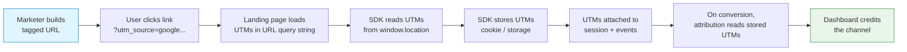

The critical insight: the UTM values exist in the URL **only at the moment of the click**. The SDK must **read and persist** them immediately, because the user will navigate away and the UTMs will vanish from the URL. The stored UTMs are then attached to the session and recalled at conversion time to assign credit.

> ✅ **Best Practice:** Persist first-touch UTMs (the very first campaign) *and* last-touch UTMs (the most recent campaign) separately. This lets you run different attribution models later without re-instrumenting. See [Attribution Models](#5-attribution-models).

> ⚠️ **Common Pitfall:** Inconsistent casing and spelling (`Google` vs `google`, `e-mail` vs `email`) fragments your reports into near-duplicate rows. Enforce a controlled vocabulary and lowercase everything. See [Naming Conventions](#7-analytics-naming-conventions).

### 2.6 Marketing concepts: Pirate Metrics (AARRR)

**AARRR**, coined by Dave McClure and nicknamed "Pirate Metrics" (because it sounds like "arrr"), is a framework that breaks the customer journey into five stages. Each stage has its own metrics and its own owner.

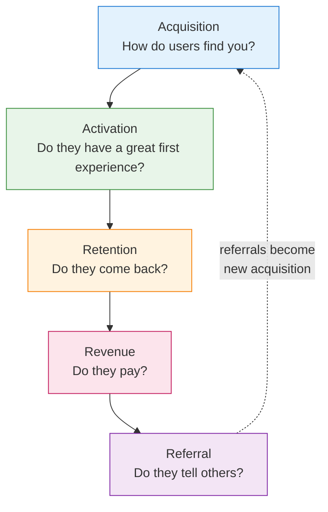

| Stage | Question | Example metric | Example event(s) |
|---|---|---|---|
| **Acquisition** | How do users find you? | Traffic by channel, signups | `page_view`, `signup_started` |
| **Activation** | Do they reach first value ("aha moment")? | Activation rate | `onboarding_completed`, `first_project_created` |
| **Retention** | Do they come back? | D1/D7/D30 retention | repeat `app_opened`, `session_start` |
| **Revenue** | Do they pay, and how much? | Conversion rate, ARPU, MRR | `subscription_purchased` |
| **Referral** | Do they bring others? | Viral coefficient, referrals sent | `invite_sent`, `referral_signup` |

> 💡 **Pro Tip:** Many teams add a leading "Awareness" stage (making AAARRR) or reorder Retention before Revenue. The exact letters matter less than the discipline of measuring each stage of the journey rather than only the final sale.

Individually, the five stages map to deeper concepts:

- **Acquisition** = getting users to your product (channels, UTMs, [attribution](#5-attribution-models)).
- **Activation** = the first valuable experience; often gated by [onboarding funnels](#11-funnels).
- **Retention** = bringing users back; measured with [cohorts](#12-cohorts) and [retention curves](#13-retention).
- **Revenue** = monetization; measured with [LTV, ARPU, MRR](#14-common-metrics).
- **Referral** = users acquiring users; the only "free" acquisition channel.

### 2.7 Event concepts

These are the building blocks of all behavioral analytics.

#### Event

- **Definition:** A record that something happened, at a time, by an actor, with context.
- **Why it matters:** The atomic unit of product analytics.
- **Example:** A user clicked "Checkout."

#### Event name

- **Definition:** The string identifying the *type* of event.
- **Why it matters:** It is how you group and count the same action across users. Naming is so important it has [its own section](#7-analytics-naming-conventions).
- **Example:** `"checkout_started"`.

#### Event properties

- **Definition:** Key-value context about *this specific occurrence* of the event.
- **Why it matters:** Properties let you slice and filter ("checkouts where `cart_value > 100`").
- **Example:** `{ "cart_value": 129.99, "item_count": 3, "currency": "USD" }`.

#### User properties

- **Definition:** Attributes of the *person* (not the event), stored on the user profile and updated over time.
- **Why it matters:** Let you segment users ("show retention for users where `plan = pro`").
- **Example:** `{ "plan": "pro", "company_size": "50-100", "signup_date": "2026-01-10" }`.

> 📌 **Important Note - event properties vs user properties:**
>
> | | Event property | User property |
> |---|---|---|
> | Describes | A single event occurrence | The person |
> | Lifespan | Frozen at event time | Mutable; reflects latest known value |
> | Example | `cart_value` on *this* purchase | `lifetime_value` of the user |
> | Set via | `track(event, properties)` | `identify(userId, traits)` |
>
> Mixing these up is one of the most common modeling errors. Ask: "is this about the click, or about the clicker?"

#### Custom dimensions

- **Definition:** (GA terminology) user- or event-scoped attributes you define beyond the defaults. Effectively GA's name for custom properties.
- **Example:** A `membership_tier` custom dimension.

#### Custom metrics

- **Definition:** (GA terminology) numeric values you define to aggregate (sum/average).
- **Example:** A `video_seconds_watched` custom metric.

#### Event parameters

- **Definition:** (GA4 terminology) the key-value pairs sent with an event. GA4's word for event properties.
- **Example:** `value`, `currency`, `items` on a `purchase` event.

#### JSON examples

A minimal event:

```json
{
  "event": "button_clicked",
  "properties": {
    "button_name": "Checkout",
    "page": "Cart"
  }
}
```

A fully enriched event as it might look after the SDK adds context (see [Event Lifecycle](#4-event-lifecycle)):

```json
{
  "event": "checkout_started",
  "event_id": "evt_01HZX8K3M2QF",
  "timestamp_client": "2026-06-29T10:12:30.221Z",
  "timestamp_server": "2026-06-29T10:12:31.004Z",
  "anonymous_id": "d-7af3c9e1",
  "user_id": "usr_8c1e0b",
  "session_id": "s-20260629-0033",
  "properties": {
    "cart_value": 129.99,
    "item_count": 3,
    "currency": "USD",
    "coupon_applied": false
  },
  "user_properties": {
    "plan": "free",
    "signup_date": "2026-06-01"
  },
  "context": {
    "page": { "path": "/cart", "referrer": "https://google.com/" },
    "campaign": {
      "source": "google",
      "medium": "cpc",
      "name": "summer_sale"
    },
    "device": { "type": "mobile", "os": "iOS 18.2" },
    "library": { "name": "analytics-js", "version": "5.4.0" }
  }
}
```

---

## 3. How Analytics Works

This section explains the full pipeline from first principles: how a click in a browser becomes a row in a warehouse.

### 3.1 The pipeline at a glance

```
Browser
  ↓
Analytics SDK
  ↓
Network Request
  ↓
Analytics Server (ingestion API)
  ↓
Storage (raw event store / queue)
  ↓
Data Warehouse
  ↓
Dashboard
```

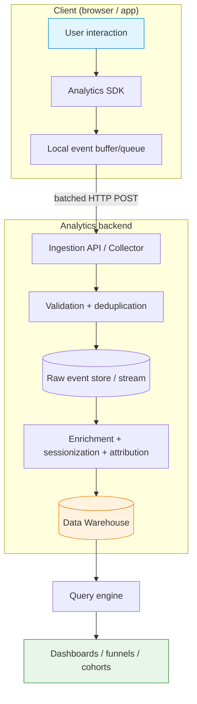

### 3.2 Event collection

The SDK exposes a small API, typically:

- `track(eventName, properties)` - record a behavioral event.
- `identify(userId, traits)` - associate the current device with a known user.
- `page()` / `screen()` - record a page or screen view.
- `group()` - associate a user with an account/organization (B2B).
- `alias()` - merge two identities.

When you call `track`, the SDK does **not** usually send the event immediately. It enriches it (adds IDs, timestamps, context, see [Section 4](#4-event-lifecycle)) and places it into a local buffer.

```javascript
// Conceptual SDK usage
analytics.identify("usr_8c1e0b", { plan: "free" });

analytics.track("checkout_started", {
  cart_value: 129.99,
  item_count: 3,
  currency: "USD"
});
```

### 3.3 Buffering and batch uploads

Sending one network request per event is wasteful (HTTP overhead, battery drain on mobile, rate limits). Instead, SDKs **buffer** events and **flush** them as a batch.

Typical flush triggers:

| Trigger | Example default |
|---|---|
| Batch size reached | every 20 events |
| Time interval elapsed | every 10-30 seconds |
| App backgrounded / page unload | flush immediately |
| Manual `flush()` call | on demand |

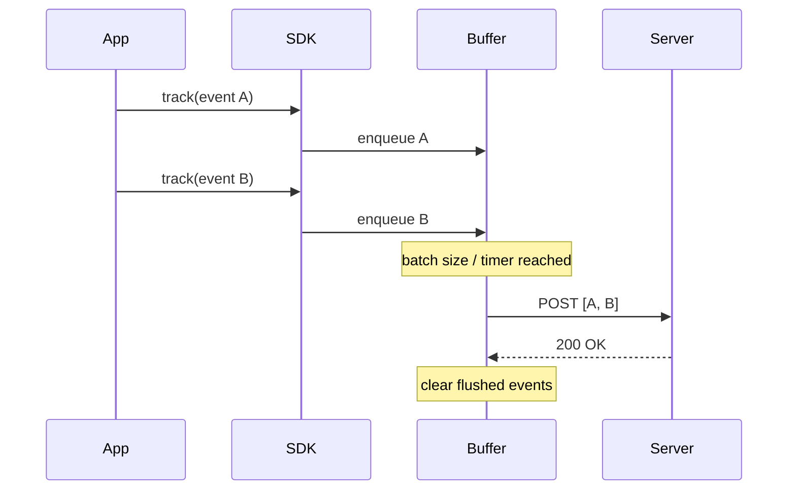

> ⚠️ **Common Pitfall:** Events buffered but not yet flushed are lost if the page closes or the app is killed. SDKs mitigate this by flushing on `visibilitychange`/`pagehide` (web) or on background (mobile), and by persisting the buffer to storage. When debugging "my last event before navigation is missing," suspect an unflushed buffer.

### 3.4 Retry and offline mode

Networks fail. A robust SDK:

- **Retries** failed uploads with **exponential backoff** (wait 1s, 2s, 4s, 8s...) plus jitter, so a recovering server is not stampeded.
- **Persists** the queue to durable storage (IndexedDB, local storage, disk), so events survive app restarts.
- Supports **offline mode**: events captured with no connectivity are stored and uploaded when the network returns.

```javascript
// Pseudo-code: retry with exponential backoff
async function flush(batch, attempt = 0) {
  try {
    await post("/v1/batch", batch);
  } catch (err) {
    if (attempt >= MAX_RETRIES) return persistToDeadLetter(batch);
    const delay = Math.min(BASE * 2 ** attempt, MAX_DELAY)
                  + Math.random() * JITTER;
    await sleep(delay);
    return flush(batch, attempt + 1);
  }
}
```

> 📌 **Important Note:** Offline mode is exactly why **client timestamps** matter. An event created offline at 9:00 and uploaded at 14:00 must keep its 9:00 client timestamp, or your data is wrong by 5 hours. See [clock skew](#244-timing-concepts).

### 3.5 Event ordering

Because of batching, retries, and offline mode, events can **arrive out of order**. The server must be able to reconstruct the true sequence.

How ordering is preserved:

- **Client timestamps** give the intended order.
- **Monotonic sequence numbers** per device/session (event 1, 2, 3...) break timestamp ties and detect gaps.
- Server reorders by `(session_id, sequence_number)` or `(timestamp_client, received_order)`.

> 🧪 **Example:** A user adds to cart, then checks out, all offline. Both upload at once. If you sorted by *server* time they could appear simultaneous or reversed. A per-session sequence number (`seq: 1` for add-to-cart, `seq: 2` for checkout) preserves the truth.

### 3.6 Deduplication and event IDs

The same event can arrive **more than once**: a retry succeeded on the server but the acknowledgement was lost, so the client retries again. Without protection, you double-count.

The fix is an **idempotency key**: every event carries a unique `event_id` (often a UUID or ULID) generated **on the client at creation time**. The server keeps a short-term record of seen IDs and discards duplicates.

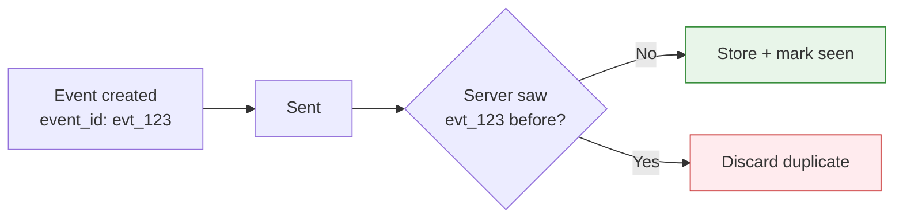

| Term | Role |
|---|---|
| **Event ID** | Globally unique key per event, set on the client. Enables deduplication and exactly-once semantics. |
| **Deduplication** | Server-side process of dropping events whose ID was already ingested. |
| **Idempotency** | The property that processing the same event twice has the same effect as once. |

> ✅ **Best Practice:** Generate the `event_id` on the client at the moment of creation, **not** on the server at receipt. A server-generated ID cannot detect a retried duplicate, because the retry would get a fresh ID. See [FAQ: "Why are events duplicated?"](#23-faq).

### 3.7 From storage to warehouse to dashboard

After ingestion and enrichment, events land in durable storage and then a **data warehouse** (BigQuery, Snowflake, Redshift, ClickHouse). The warehouse is optimized for analytical queries over billions of rows.

- **Storage / raw event store:** append-only, immutable record of every event. The source of truth.
- **Warehouse:** modeled, queryable tables (often transformed via an [ETL/ELT](#2421-our-analytics-standards) process).
- **Dashboard:** the visualization layer (funnels, retention curves, charts) that humans read.

> 💡 **Pro Tip:** Keep raw events immutable. When (not if) you discover a bug in your transformation logic, you want to reprocess from raw rather than having destroyed the original data. "Raw is sacred" is a core data-engineering principle.

---

## 4. Event Lifecycle

This section traces a single event from a click to a report, naming every field that gets attached and when.

### 4.1 The stages

```
User clicks button
  ↓
SDK captures
  ↓
Properties attached
  ↓
User properties added
  ↓
Session info attached
  ↓
UTM attached
  ↓
Timestamp added
  ↓
Upload
  ↓
Processing
  ↓
Storage
  ↓
Reporting
```

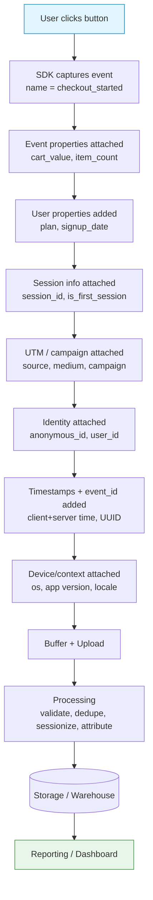

### 4.2 What each stage adds

| Stage | Field(s) attached | Source | Notes |
|---|---|---|---|
| SDK captures | `event` (name) | Your `track()` call | The only required argument besides properties |
| Properties | `properties.*` | Your `track()` call | Context of this occurrence |
| User properties | `user_properties.*` | Last `identify()` traits | Snapshot of who the user is |
| Session info | `session_id`, `is_first_session` | SDK session manager | See [Sessions](#10-sessions) |
| UTM / campaign | `context.campaign.*` | Persisted from landing URL | First-touch and/or last-touch |
| Identity | `anonymous_id`, `user_id` | SDK identity store | `user_id` null if anonymous |
| Timestamps + ID | `timestamp_client`, `event_id`, `seq` | SDK at creation | `event_id` enables dedup |
| Device / context | `context.device`, `context.os`, `context.library` | SDK auto-collected | Locale, screen size, app version |
| Upload | (none) | network | Batched |
| Processing | `timestamp_server`, enriched attributes | Server | Validation, geo-IP, attribution |
| Storage | (row in warehouse) | Pipeline | Immutable |
| Reporting | (aggregations) | Query layer | Funnels, retention, etc. |

> 📌 **Important Note:** The order matters. Identity and UTMs must be resolved **before** upload, because the server may not have the context the client had. The client is the only place that knows the current session, the persisted first-touch UTM, and the device clock.

> 🧪 **Worked example - the same click, fully enriched:**
>
> A user on an iPhone, who arrived two days ago from a Google Ad and signed up yesterday, clicks "Checkout":
>
> ```json
> {
>   "event": "checkout_started",
>   "event_id": "evt_01HZX8K3M2QF7Y",
>   "seq": 7,
>   "timestamp_client": "2026-06-29T10:12:30.221Z",
>   "timestamp_server": "2026-06-29T10:12:30.998Z",
>   "anonymous_id": "d-7af3c9e1",
>   "user_id": "usr_8c1e0b",
>   "session_id": "s-20260629-0033",
>   "is_first_session": false,
>   "properties": { "cart_value": 129.99, "item_count": 3, "currency": "USD" },
>   "user_properties": { "plan": "free", "signup_date": "2026-06-28" },
>   "context": {
>     "campaign_first_touch": { "source": "google", "medium": "cpc", "name": "summer_sale" },
>     "campaign_last_touch":  { "source": "newsletter", "medium": "email", "name": "weekly_digest" },
>     "device": { "type": "mobile", "os": "iOS 18.2", "model": "iPhone15,3" },
>     "page": { "path": "/cart" },
>     "library": { "name": "analytics-js", "version": "5.4.0" }
>   }
> }
> ```
>
> Notice both first-touch (Google) and last-touch (newsletter) campaigns travel with the event, so any attribution model can be applied later. See [Section 5](#5-attribution-models).

---

## 5. Attribution Models

**Attribution** is the art and science of deciding *which marketing touchpoint(s) deserve credit* for a conversion. It is one of the most consequential and most misunderstood areas of analytics, because it directly drives how marketing budgets are spent.

### 5.1 The core problem

Users rarely convert on first contact. A realistic journey:

```
Google Ad  →  Blog post  →  Newsletter  →  LinkedIn  →  Purchase
 (Day 1)      (Day 3)        (Day 8)        (Day 12)     (Day 14)
```

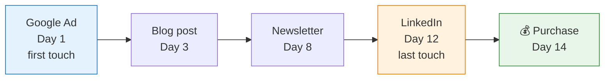

Five touchpoints contributed. Who gets credit for the sale? The answer depends on the **attribution model** you choose. Different models will tell you to spend your budget very differently, even on the exact same data.

> 📌 **Important Note:** Attribution is a *modeling choice*, not a fact. There is no single "correct" answer. The goal is to pick a model whose assumptions match how your buyers actually decide, and to be consistent so trends are comparable over time.

We will use the journey above (100 USD conversion value) to show how each model assigns credit.

### 5.2 First-touch attribution

**100% of credit to the first interaction.**

| | |
|---|---|
| **Credit split** | Google Ad: 100. All others: 0. |
| **Question it answers** | "Which channel *discovers* new customers?" |
| **Advantages** | Simple; rewards top-of-funnel/awareness channels; good for demand-generation analysis. |
| **Disadvantages** | Ignores everything that nurtured and closed the deal; over-credits the first channel. |
| **When to use** | When your priority is finding new audiences and measuring awareness. |

### 5.3 Last-touch attribution

**100% of credit to the final interaction before conversion.** This is the historical default of most tools.

| | |
|---|---|
| **Credit split** | LinkedIn: 100. All others: 0. |
| **Question it answers** | "Which channel *closes* the sale?" |
| **Advantages** | Dead simple; matches "what happened right before they bought"; easy to explain. |
| **Disadvantages** | Ignores the entire journey that built intent; over-credits bottom-funnel/branded channels. |
| **When to use** | Short sales cycles, or when you only care about the closing channel. |

> ⚠️ **Common Pitfall - "last non-direct" nuance:** Pure last-touch often credits "direct" traffic (user typed your URL), which is not really a marketing channel. Many tools default to **last non-direct touch** to avoid crediting the conversion to "the user already knew us." Know which variant your tool uses, see [FAQ](#23-faq).

### 5.4 Linear attribution

**Credit split equally across all touchpoints.**

| | |
|---|---|
| **Credit split** | Each of 5 touches: 20. |
| **Question it answers** | "What is the full set of channels involved, weighted evenly?" |
| **Advantages** | Acknowledges the whole journey; no single channel is ignored. |
| **Disadvantages** | Pretends all touches are equally important, which is rarely true. |
| **When to use** | Long, multi-touch journeys where every interaction plausibly matters. |

### 5.5 Position-based (U-shaped) attribution

**Most credit to the first and last touch, the rest shared among middle touches.** A common split is 40% first, 40% last, 20% shared by the middle.

| | |
|---|---|
| **Credit split** | Google Ad: 40, LinkedIn: 40, the three middle touches share 20 → ~6.7 each. |
| **Question it answers** | "Who discovered and who closed, while still acknowledging the middle?" |
| **Advantages** | Rewards the two arguably most important moments (first interest, final push). |
| **Disadvantages** | The 40/20/40 weighting is a convention, not a derived truth. |
| **When to use** | When both demand generation and closing matter and you want a balanced default. |

### 5.6 Time-decay attribution

**More credit to touches closer in time to the conversion.** Credit decays exponentially as you go back (e.g. a 7-day half-life).

| | |
|---|---|
| **Credit split** | LinkedIn (Day 12) > Newsletter (Day 8) > Blog (Day 3) > Google Ad (Day 1). |
| **Question it answers** | "Which recent touches drove the final decision?" |
| **Advantages** | Reflects that recent interactions often weigh more in a decision. |
| **Disadvantages** | Systematically under-credits awareness channels that plant the first seed. |
| **When to use** | Longer sales cycles where momentum builds toward the close. |

### 5.7 Data-driven attribution

**Credit assigned by a statistical/ML model that learns each touchpoint's actual incremental contribution** from your historical converting and non-converting paths.

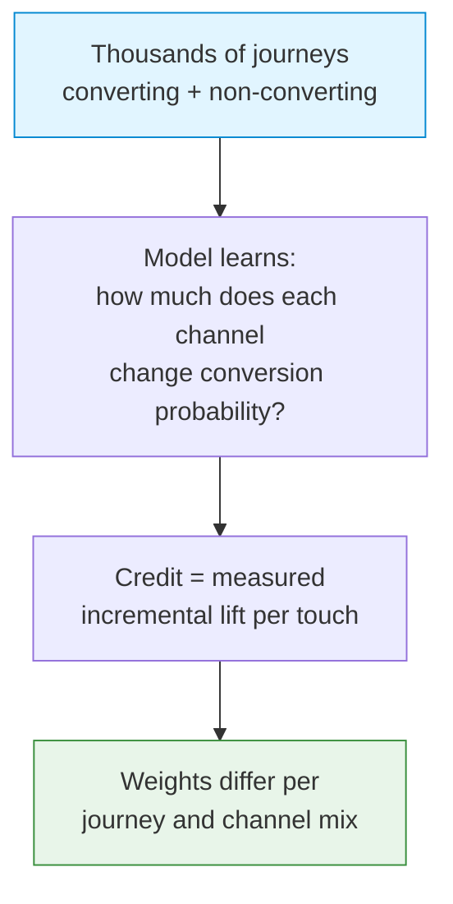

| | |
|---|---|
| **Credit split** | Determined by the model; e.g. it might learn the newsletter is the real driver and weight it highest, even though it is neither first nor last. |
| **Question it answers** | "What is each channel's *incremental* contribution, empirically?" |
| **Advantages** | Most accurate when data volume is sufficient; reduces human bias. |
| **Disadvantages** | Requires lots of data; is a "black box"; harder to explain; can shift as the model retrains (see [FAQ: "Why is attribution changing?"](#23-faq)). |
| **When to use** | High traffic, mature analytics, where precision justifies complexity. GA4 and large ad platforms default to this. |

### 5.8 Side-by-side comparison

Using the 5-touch, 100 USD journey:

| Touchpoint | First-touch | Last-touch | Linear | Position (40/20/40) | Time-decay | Data-driven |
|---|---|---|---|---|---|---|
| Google Ad (Day 1) | **100** | 0 | 20 | 40 | ~7 | learned |
| Blog (Day 3) | 0 | 0 | 20 | ~6.7 | ~12 | learned |
| Newsletter (Day 8) | 0 | 0 | 20 | ~6.7 | ~24 | learned |
| LinkedIn (Day 12) | 0 | **100** | 20 | 40 | ~57 | learned |
| Purchase touch | n/a | n/a | n/a | n/a | n/a | n/a |
| **Total** | 100 | 100 | 100 | 100 | 100 | 100 |

(Time-decay figures are illustrative; exact values depend on the half-life.)

> 💡 **Pro Tip:** Notice every model totals 100. Attribution **redistributes** a fixed amount of credit; it never creates more. The debate is purely about *how to split*, which is why two honest analysts can disagree without either being wrong.

### 5.9 Choosing a model

| Your situation | Suggested starting model |
|---|---|
| Short, impulse purchases | Last-touch |
| Awareness/brand-building focus | First-touch |
| Long B2B sales cycle | Position-based or time-decay |
| Lots of data, mature team | Data-driven |
| You are not sure | Position-based (a reasonable balanced default) |

> ✅ **Best Practice:** Persist enough raw touch data (first-touch and last-touch UTMs, plus the full touch timeline if possible) so you can recompute *any* model later. The worst position is having committed to one model at collection time and being unable to answer "what would last-touch say?" without re-instrumenting.

---

## 6. Industry Standards

Different platforms make different default choices. Knowing them prevents the classic "the same metric is different in two tools" confusion (it is usually a definition difference, not a bug).

### 6.1 Platform comparison

| Platform | Session model | User identification | Default attribution | Event naming style | Best at |
|---|---|---|---|---|---|
| **Google Analytics 4** | Event-based; 30-min timeout, resets on new campaign | `user_id` + Google Signals + device | Data-driven (default) | `snake_case`, recommended event list | Web + app, free, ads integration |
| **Mixpanel** | 30-min inactivity sessions (configurable) | `distinct_id`; `identify`/`alias` merge | Configurable; report-time | `Title Case` or `snake_case` (Object Action) | Product analytics, funnels, retention |
| **Amplitude** | 30-min inactivity (configurable) | `user_id` + `device_id` resolution | Configurable; report-time | `Object Action` (`Song Played`) | Behavioral cohorts, experimentation |
| **Segment** | Does not define sessions; it is a router | `userId` + `anonymousId`; `identify`/`alias` | n/a (forwards to destinations) | `Object Action`, Title Case (spec) | CDP / piping data to many tools |
| **Adobe Analytics** | Visit-based; 30-min timeout | Visitor ID / ECID; CDP via AEP | Rule-based + Adobe data-driven | eVars/props/events (numbered) | Enterprise, deep customization |
| **PostHog** | 30-min inactivity sessions | `distinct_id`; `identify`/`alias`/`merge` | Configurable | `snake_case` recommended | Open-source, self-host, product+session replay |

### 6.2 Notable details and trade-offs

**Google Analytics 4**

- Strengths: free, tight Google Ads integration, BigQuery export, cross web+app.
- Weaknesses: sampling on large/complex queries, steeper learning curve, data thresholds.
- Enterprise usage: marketing attribution, web traffic, ad ROAS.
- Quirk: a **new session starts whenever a new campaign/UTM is detected**, even within the timeout window, which can inflate session counts versus other tools.

**Mixpanel**

- Strengths: fast funnels and retention, friendly UI, generous identity merging.
- Weaknesses: sessions are a later add-on (it is event-first), cost at scale.
- Enterprise usage: product teams analyzing feature adoption.
- Naming: official guidance favors `Object Action` in Title Case (`Signup Completed`).

**Amplitude**

- Strengths: behavioral cohorts, pathfinder, experiment analysis.
- Weaknesses: can be expensive; modeling discipline required to stay clean.
- Naming: `Object Action` (`Song Played`, `Page Viewed`).

**Segment (a CDP, not an analytics tool)**

- Strengths: collect once, route to many destinations; consistent schema.
- Weaknesses: it does not analyze; you still need a destination tool. Cost scales with volume.
- Spec: the canonical `track`/`identify`/`page`/`group`/`alias` API that many others mimic.

**Adobe Analytics**

- Strengths: extreme enterprise customization, governance, integration with Adobe Experience Cloud.
- Weaknesses: complexity, cost, specialist skills (eVars, props, processing rules).
- Enterprise usage: large enterprises with dedicated analytics teams.

**PostHog**

- Strengths: open-source, self-hostable (data sovereignty), bundles analytics + session replay + feature flags + experiments.
- Weaknesses: younger ecosystem; self-hosting has ops cost.
- Enterprise usage: privacy-sensitive orgs, engineering-led product teams.

> 💡 **Pro Tip - the unifying pattern:** Almost everyone uses a **30-minute inactivity session** and an **`identify`/`alias`/`merge`** identity model derived from the Segment spec. If you learn that core model, every tool feels familiar. The biggest gotcha is GA4 restarting sessions on new campaigns.

> ⚠️ **Common Pitfall:** Comparing absolute numbers across tools and assuming a discrepancy is a bug. A 5-10% gap between, say, GA4 sessions and Mixpanel sessions is *expected* due to differing session definitions, bot filtering, and consent handling. Compare *trends within one tool*, not absolute numbers across tools.

---

## 7. Analytics Naming Conventions

Naming is where most analytics implementations quietly rot. Good names are the difference between a self-explanatory dataset and an unusable mess of `btn2`, `ButtonClickFinal`, and `checkout_v3_REAL`.

### 7.1 The golden rule: pick one convention and enforce it

| | Good | Bad |
|---|---|---|
| Event name | `checkout_started` | `CheckoutButtonClickedAgain2` |
| Casing | `snake_case` (lowercase, underscores) | `MixedCase Button-Click` |
| Structure | `object_action` (`order_completed`) | `clicked_the_big_green_button` |
| Tense | Past tense (`signup_completed`) | Future/imperative (`do_signup`) |

### 7.2 snake_case

Use **lowercase letters and underscores**: `video_played`, `subscription_purchased`. It is unambiguous, URL-safe, SQL-friendly (no quoting needed), and avoids the casing-fragmentation problem where `videoPlayed`, `VideoPlayed`, and `video played` become three different events.

> 📌 **Important Note:** Some tools (Mixpanel, Amplitude) conventionally use `Object Action` Title Case. That is fine; the rule is *consistency within your project*, not which style you pick. This handbook uses `snake_case` as its default. Decide once, document it in [Section 21](#21-our-analytics-standards), and enforce it.

### 7.3 The object-action pattern

Name events as `<object>_<action>`, both stated as a noun + past-tense verb:

| Object | Action | Event name |
|---|---|---|
| order | completed | `order_completed` |
| video | played | `video_played` |
| signup | started | `signup_started` |
| invite | sent | `invite_sent` |

This groups naturally: all `order_*` events sort together, all `*_completed` events can be found with one filter. It scales far better than free-form names.

### 7.4 Naming consistency

- Use the **same word for the same concept** everywhere. Do not mix `signup`, `sign_up`, and `register` for the same action.
- Keep a controlled vocabulary of verbs: `started`, `completed`, `viewed`, `clicked`, `created`, `deleted`, `updated`, `failed`.
- Apply the same discipline to **property names** (`cart_value`, not `cartVal` in one place and `cart_total` in another).

### 7.5 Versioning

Events evolve. Strategies, in rough order of preference:

1. **Add, do not mutate.** Add a new property rather than redefining an old one. Old data stays valid.
2. **Version the property, not the name,** when semantics change: include `schema_version: 2` so consumers know how to interpret it.
3. **Only as a last resort, version the event name** (`checkout_started_v2`) when the meaning fundamentally changed and the old and new must be distinguished. This is ugly; avoid if possible.

> ⚠️ **Common Pitfall:** Silently changing what an existing event means (e.g. `checkout_started` used to fire on cart open, now fires on the payment page). Historical trends break and nobody knows why. If meaning changes, treat it as a new event or version it explicitly.

### 7.6 Reserved names

Most platforms reserve certain event and property names (`$identify`, `page_view`, `session_start`, names beginning with `$` or `ga_` or `firebase_`). Using them collides with built-in behavior.

> ✅ **Best Practice:** Check your platform's reserved-name list before designing your taxonomy. Avoid prefixes like `$`, `ga_`, `firebase_`, and `mp_` for your custom events.

### 7.7 Prefixes

Prefixes help namespace events by domain or surface:

- By feature area: `billing_invoice_paid`, `auth_login_succeeded`.
- By platform when needed: keep the same event name across platforms and use a `platform` property instead of `web_login` / `ios_login`. One event, one property, is far easier to analyze.

> 💡 **Pro Tip:** Prefer **one event with a property** over **many near-identical events**. `button_clicked` with `{ button_name: "checkout" }` beats `checkout_button_clicked`, `cancel_button_clicked`, `save_button_clicked`. It keeps your event count low and your analysis flexible. (Caveat: do not over-collapse; truly distinct actions deserve distinct events.)

---

## 8. Event Design Best Practices

Designing an event well, before you write the code, saves months of cleanup.

### 8.1 How to design an event

Ask, in order:

1. **What decision will this event inform?** If none, do not track it.
2. **What is the object and action?** Gives you the name ([Section 7](#7-analytics-naming-conventions)).
3. **What context will an analyst need to slice this?** Gives you the properties.
4. **Who owns this event** and where is it documented? ([Section 15](#15-event-taxonomy)).

### 8.2 How many properties?

Enough to answer your questions, not so many that the event becomes a junk drawer. A practical range is **5-15 properties** for a rich event. If you find yourself adding 40 properties, the event is probably doing too much.

| Property tier | Definition | Example for `order_completed` |
|---|---|---|
| **Required** | Always present; analysis breaks without them | `order_id`, `value`, `currency` |
| **Recommended** | Present whenever known; enable key slices | `item_count`, `payment_method`, `coupon_code` |
| **Optional** | Nice to have; situational | `gift_wrap`, `delivery_notes` |

### 8.3 Required vs optional properties

> ✅ **Best Practice:** Define a small set of **globally required properties** that ride on *every* event (e.g. `app_version`, `platform`, `session_id`). Then per-event required properties on top. Enforce them in a thin tracking wrapper so a missing required property is caught at development time, not discovered in the warehouse months later.

```javascript
// A thin wrapper that enforces required global properties
function track(event, properties = {}) {
  const globals = {
    app_version: APP_VERSION,
    platform: getPlatform(),
    session_id: getSessionId(),
  };
  if (!event || !/^[a-z]+(_[a-z]+)+$/.test(event)) {
    throw new Error(`Invalid event name: ${event}`); // enforce snake_case
  }
  analytics.track(event, { ...globals, ...properties });
}
```

### 8.4 Avoid high-cardinality properties

**Cardinality** is the number of distinct values a property can take. Very high cardinality (unbounded unique values) makes a poor *dimension* to group by, bloats indexes, and is rarely useful as a breakdown.

| Property | Cardinality | Good as a group-by dimension? |
|---|---|---|
| `plan` (free/pro/enterprise) | Low (3) | ✅ Yes |
| `country` | Medium (~200) | ✅ Yes |
| `user_id` | Very high | ⚠️ As an identifier, yes; as a chart breakdown, no |
| `raw_search_query` | Unbounded | ❌ No (store it, but do not group reports by it) |
| `full_url_with_querystring` | Unbounded | ❌ No (parse out the useful parts instead) |

> 💡 **Pro Tip:** High-cardinality values are fine to *store* (you may need a raw search query for debugging). The pitfall is using them as the *axis* of a chart, which produces a million one-row buckets. Capture raw, but also capture a normalized low-cardinality version for grouping (e.g. `search_query_length_bucket: "1-3 words"`).

### 8.5 Avoid PII in events

**PII (Personally Identifiable Information)** includes names, emails, phone numbers, addresses, government IDs, precise location, and payment details. Do not put it in event names or properties unless you have a deliberate, compliant reason and the right controls.

> 📌 **Important Note:** PII in analytics is a legal and security liability ([GDPR/CCPA](#17-privacy-and-compliance)). Analytics tools are widely shared internally and often replicate data to third parties. Keep PII in your secure systems of record, and reference users in analytics by an opaque `user_id` only.

| Instead of tracking... | Track... |
|---|---|
| `email: "jane@acme.com"` | `user_id: "usr_8c1e0b"`, `email_domain: "acme.com"` |
| `full_address` | `country`, `postal_code_prefix` |
| `credit_card_number` | `payment_method: "visa"`, `card_last4` only if truly needed |
| `phone_number` | nothing, or a hashed token if matching is required |

### 8.6 A complete worked example

> 🧪 **Example - designing `subscription_purchased`:**
>
> Decision it informs: "Which plans and channels drive revenue, and what is ARPU by cohort?"
>
> ```json
> {
>   "event": "subscription_purchased",
>   "properties": {
>     "plan": "pro",                  // low cardinality, required
>     "billing_period": "annual",     // low cardinality, required
>     "value": 199.00,                // required for revenue
>     "currency": "USD",              // required to interpret value
>     "is_trial_conversion": true,    // recommended, enables slice
>     "coupon_code": "LAUNCH20",      // recommended (low cardinality if controlled)
>     "payment_method": "card"        // recommended
>   }
> }
> ```
>
> Notice: no PII, no unbounded properties, every field maps to a question an analyst will ask, and `value` + `currency` always travel together (a revenue number without a currency is meaningless).

---

## 9. User Identification

Identity is how you connect a stream of anonymous events to a real person, across sessions and devices. Done well, it is invisible. Done badly, it splits one user into many or merges different users into one.

### 9.1 The identity journey

```
Anonymous user
  ↓ (browses with device_id only)
Sign up
  ↓ (identify call links device_id ↔ user_id)
Merge identities
  ↓ (pre-signup anonymous history attributed to the user)
Known user
```

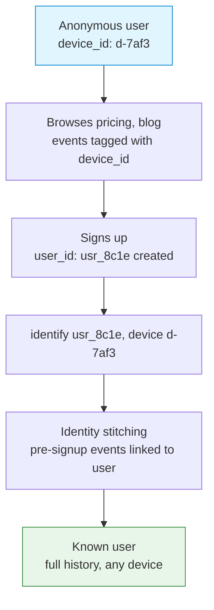

### 9.2 Identity stitching

**Identity stitching** is connecting the anonymous identifier (`device_id` / `anonymous_id`) to the known `user_id` so that the pre-identification behavior is credited to the right person. When you call `identify`, the platform records the mapping and (in most tools) retroactively links prior anonymous events.

> 🧪 **Example:** A visitor reads three blog posts and the pricing page over two days, all anonymous (`device_id: d-7af3`). On day 3 they sign up; you call `identify("usr_8c1e", ...)`. Stitching ties those earlier blog and pricing views to `usr_8c1e`, so you can now see that "users who read the pricing page convert better," a fact that would be invisible without stitching.

### 9.3 Aliasing

**Aliasing** explicitly tells the platform that two identifiers are the *same* person, typically merging a pre-signup anonymous ID with a new `user_id`. Some platforms require an explicit `alias()` call; others merge automatically on `identify`.

```javascript
// At signup, before the user_id is associated:
analytics.alias("usr_8c1e0b");          // tie anonymous_id -> new user_id
analytics.identify("usr_8c1e0b", {       // then set who they are
  plan: "free",
  signup_date: "2026-06-29"
});
```

> ⚠️ **Common Pitfall:** Calling `alias` more than once for the same user, or aliasing two *real* users together (e.g. on a shared device). Aliasing is often irreversible and can permanently merge two people's data. Alias exactly once, at the identity-creation moment.

### 9.4 Cross-device tracking

A single person uses a phone, a laptop, and a tablet. Each has its own `device_id`. **Cross-device tracking** unifies them under one `user_id`.

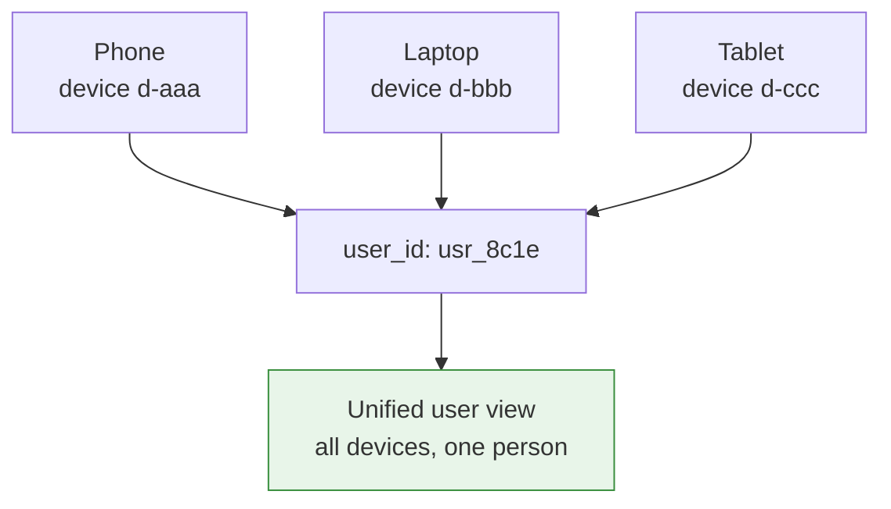

The mechanism: the user logs in (or otherwise identifies) on each device, and each device's `device_id` is mapped to the same `user_id`. Before login, the devices remain separate anonymous identities.

> 📌 **Important Note:** You can only stitch devices that have *all* been identified. A user who logs in on their laptop but only browses anonymously on their phone leaves the phone history unlinked. This is a fundamental limit, not a bug.

### 9.5 Identity model summary

| Identifier | Scope | Stable across logout? | Stable across devices? |
|---|---|---|---|
| `anonymous_id` / `device_id` | One browser/device | Yes (until storage cleared) | No |
| `user_id` | One person/account | Yes | Yes (once identified on each device) |
| `session_id` | One visit | No | No |

> ✅ **Best Practice:** Use an **opaque, immutable internal `user_id`**. Never use email/username as the identity key (it can change, it is PII, and people share accounts). Set the `user_id` as early as you safely can after authentication, and let the platform stitch the prior anonymous activity.

---

## 10. Sessions

A **session** groups a user's events into a single "visit." Sessions are how you measure visit duration, depth, bounce, and engagement.

### 10.1 How sessions are created

Most platforms create sessions implicitly: the **first event after a period of inactivity** starts a new session. There is usually no explicit "start a session" call; the SDK manages a session timer.

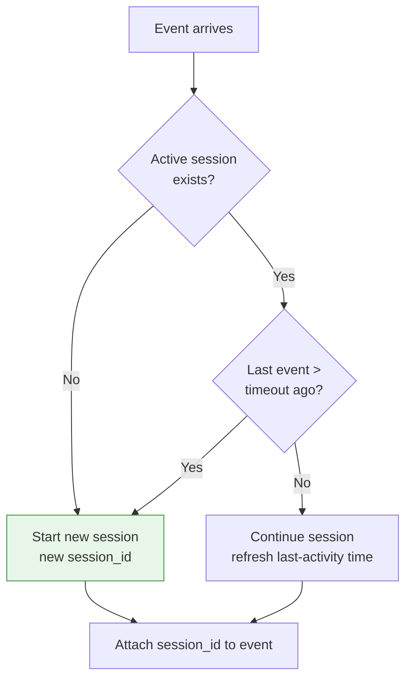

### 10.2 When sessions expire: the 30-minute timeout

The industry-standard **session timeout is 30 minutes of inactivity**. If a user does nothing for 30 minutes and then acts, that action begins a new session.

> 🧪 **Example:**
> - 10:00 user opens app (session A starts)
> - 10:10 user clicks (session A continues; timer resets to 10:10)
> - 10:50 user clicks again. Gap from 10:10 is 40 minutes > 30 → **session B starts.**
>
> Result: two sessions, even though it is "one sitting" loosely. The 30-minute rule is a convention that approximates "the user stepped away."

### 10.3 Custom timeout

The 30-minute default does not fit every product. A meditation app with 60-minute sessions, or a trading app where 5 minutes idle means "gone," may configure a different timeout.

| Product type | Reasonable timeout |
|---|---|
| General web/app | 30 min (default) |
| Long-form content / video | 60+ min |
| High-frequency utility (trading, chat) | shorter, 5-15 min |

> ⚠️ **Common Pitfall:** Changing the session timeout retroactively changes historical session counts and durations, breaking trend comparisons. Pick a timeout deliberately and document it ([Section 21](#21-our-analytics-standards)); change it rarely and annotate the date on charts.

### 10.4 Background app behavior (mobile)

On mobile, "inactivity" is complicated by backgrounding:

- When the app goes to the **background**, the SDK usually pauses the session timer.
- If the user returns **within the timeout**, the same session resumes.
- If they return **after** the timeout, a new session starts.
- A short background (e.g. answering a notification) should *not* fragment one session into two.

> 💡 **Pro Tip:** Test the "background for 31 minutes then resume" case explicitly. It is the boundary that most often reveals a misconfigured mobile session manager.

### 10.5 Web behavior

On the web:

- Sessions are tracked via cookies/storage and the same 30-minute inactivity rule.
- A new browser tab to your site is usually the *same* session if within the window.
- **Closing the browser does not reliably end the session** (no guaranteed event fires); the session simply times out.
- GA4 also **starts a new session when a new UTM/campaign is detected**, even mid-window (see [Section 6](#6-industry-standards)).

### 10.6 Mobile vs web sessions

| Aspect | Web | Mobile |
|---|---|---|
| Trigger to start | First event / page load | App open / first event |
| Inactivity timer | 30 min default | 30 min default, paused on background |
| Clean end? | No (inferred by timeout) | Sometimes (on background, configurable) |
| Backgrounding | n/a (tab visibility) | Pauses/handles session |
| Campaign restart (GA4) | Yes | Yes |

> 📌 **Important Note:** Because web and mobile compute sessions slightly differently, a cross-platform "total sessions" number is an approximation. When precision matters, segment by platform.

---

## 11. Funnels

A **funnel** measures how many users progress through an ordered sequence of steps toward a goal, and where they drop off. It is the single most useful product-analytics tool for finding friction.

### 11.1 What a funnel shows

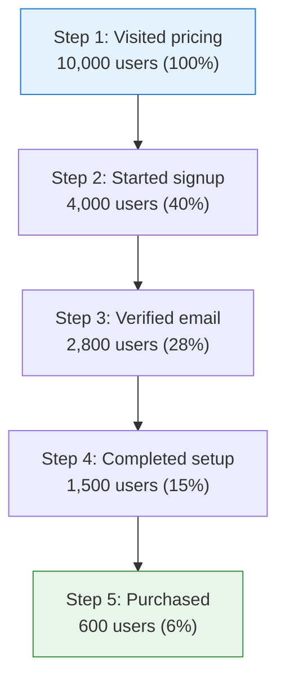

The big drop from step 1 to step 2 (60% lost) is where you focus. Each step's **conversion rate** is `users_at_step / users_at_previous_step`; the **overall conversion** is `users_at_last_step / users_at_first_step` (here 6%).

### 11.2 Types of funnels

| Funnel type | Question | Example steps |
|---|---|---|
| **Marketing funnel** | How does an audience become a lead? | Impression → Click → Landing → Lead |
| **Product funnel** | How do users complete an in-product task? | Open editor → Add item → Save → Share |
| **Conversion funnel** | How do users reach a revenue goal? | Cart → Checkout → Payment → Purchase |

These overlap; a full journey often chains a marketing funnel into a product funnel into a conversion funnel.

### 11.3 Funnel analysis nuances

- **Order matters or not?** A *strict* funnel requires steps in exact order; a *relaxed* funnel allows other events in between. Choose deliberately.
- **Conversion window:** funnels usually require completion within a time window (e.g. "signup within 7 days of first visit"). A 1-hour window and a 30-day window give very different numbers.
- **Unique users vs events:** count each user once per step, or you can over-count someone who retried.

> 🧪 **Example - e-commerce checkout funnel:**
>
> | Step | Event | Users | Step conv. | Drop-off |
> |---|---|---|---|---|
> | 1 | `cart_viewed` | 8,000 | - | - |
> | 2 | `checkout_started` | 5,200 | 65% | 2,800 lost |
> | 3 | `shipping_submitted` | 4,600 | 88% | 600 lost |
> | 4 | `payment_submitted` | 3,900 | 85% | 700 lost |
> | 5 | `order_completed` | 3,600 | 92% | 300 lost |
>
> Overall conversion: 3,600 / 8,000 = **45%**. The worst step is cart → checkout (65%), so that is where a "guest checkout" experiment would be aimed.

> ✅ **Best Practice:** Instrument *every* funnel step as its own event with consistent properties (`cart_value`, `step_number`). You cannot build a funnel for a step you never tracked, and you cannot diagnose drop-off without properties to segment by (device, plan, country).

> ⚠️ **Common Pitfall:** Defining a too-tight conversion window so legitimate conversions fall outside it, making the funnel look worse than reality. Match the window to your real buying cycle.

---

## 12. Cohorts

A **cohort** is a group of users who share a defining characteristic, usually *when they started* or *what they did*. Cohort analysis compares groups over time and is the backbone of retention and behavioral analysis.

### 12.1 Static cohorts

- **Definition:** A fixed list of users, frozen at creation. Membership never changes.
- **Use:** "Users who signed up during the March launch." You want to track *those exact people* forever.
- **Example:** Export the 1,200 users from the launch week and follow their retention for a year.

### 12.2 Dynamic cohorts

- **Definition:** A rule-based group whose membership is recomputed continuously. Users enter and leave as they meet or stop meeting the criteria.
- **Use:** "Users active in the last 7 days." The set changes daily.
- **Example:** A "power users" cohort defined as "sent 10+ messages in the last week" automatically gains and loses members.

### 12.3 Behavioral cohorts

- **Definition:** A group defined by *actions taken* (a special, powerful kind of dynamic cohort).
- **Use:** Compare outcomes of users who did X versus those who did not.
- **Example:** "Users who created a project in their first session" vs "users who did not," compared on Day-30 retention. If the first cohort retains far better, "create a project in session one" becomes your activation goal.

| Cohort type | Membership | Changes over time? | Typical use |
|---|---|---|---|
| Static | Fixed list | No | Track a specific group long-term |
| Dynamic | Rule-based | Yes | Live segments (active, at-risk) |
| Behavioral | Action-based | Yes | Find what behaviors drive retention |

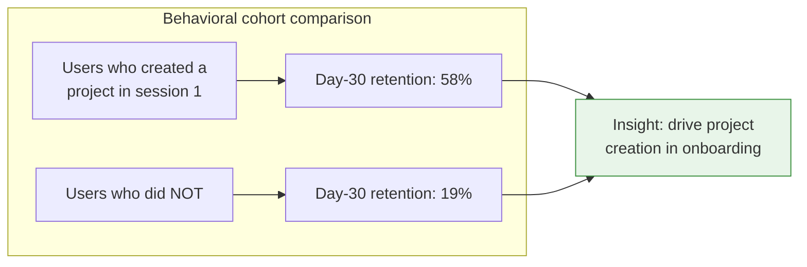

> 💡 **Pro Tip:** Behavioral cohorts are how you discover your **activation event**, the early action most correlated with long-term retention (Facebook's famous "7 friends in 10 days," Slack's "2,000 messages sent"). Find yours, then redesign onboarding to drive users toward it. See [Retention](#13-retention) and [Funnels](#11-funnels).

---

## 13. Retention

**Retention** measures whether users come back over time. It is arguably the single most important indicator of product-market fit: acquisition without retention is a leaky bucket.

### 13.1 The retention curve

Retention is usually shown as the percentage of a cohort still active N days after they started.

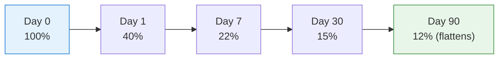

A healthy curve **flattens** into a stable plateau (a retained core), rather than decaying to zero. The plateau height is your long-term retained fraction.

### 13.2 Day 1, Day 7, Day 30

These are checkpoints on the curve:

- **Day 1 (D1):** Did they come back the next day? An early signal of first-experience quality.
- **Day 7 (D7):** Weekly habit forming?
- **Day 30 (D30):** Durable, monthly-relevant?

> 🧪 **Example:** D1 = 40%, D7 = 22%, D30 = 15% means of 100 new users, 40 returned on day 1, 22 in the day-7 window, 15 in the day-30 window.

### 13.3 Classic vs rolling retention

This distinction trips up many people:

| | Classic (N-day / bracket) retention | Rolling (unbounded) retention |
|---|---|---|
| **Counts a user as retained on Day N if...** | they were active *on exactly Day N* (or in that day's bracket) | they were active *on Day N or any day after* |
| **Strictness** | Stricter; misses users who skip day N but return later | More forgiving; counts anyone who ever came back at/after N |
| **Best for** | Daily-habit products (where daily return matters) | Infrequent-use products (where "still a user" matters more than daily) |

> 🧪 **Example:** A user active on Day 0, absent Day 7, but active Day 9.
> - **Classic D7 retention:** not retained (was not active on day 7).
> - **Rolling D7 retention:** retained (active on day 9, which is ≥ day 7).
>
> Choose the definition that matches how often your product is *meant* to be used. Reporting the wrong one makes a healthy infrequent-use product look like it is dying.

### 13.4 Stickiness: DAU, WAU, MAU, and the ratio

| Metric | Meaning |
|---|---|
| **DAU** | Daily Active Users: unique users active in a day |
| **WAU** | Weekly Active Users: unique users active in a 7-day window |
| **MAU** | Monthly Active Users: unique users active in a 30-day window |
| **DAU/MAU** | **Stickiness ratio**: fraction of monthly users who use it on an average day |

**Stickiness = DAU / MAU.** It approximates "how many days per month does an average active user show up."

> 🧪 **Example:** DAU = 20,000, MAU = 100,000 → DAU/MAU = 0.20 (20%), meaning the average monthly user is active about 6 days a month (0.20 × 30). For a daily-habit product, 20%+ is decent and 50%+ is excellent; for an inherently weekly product, a lower ratio is normal and not alarming.

> 📌 **Important Note:** "Active" must be defined by a *meaningful* action (see [Active user](#21-user-concepts)). If "active" just means "opened the app," your DAU/MAU is measuring notifications, not value.

> ✅ **Best Practice:** Pair retention with a behavioral cohort analysis ([Section 12](#12-cohorts)) to find *why* the retained core retains, then drive new users toward that behavior. Retention tells you *whether*; cohorts tell you *why*.

---

## 14. Common Metrics

Definitions, formulas, and worked examples for the metrics you will be asked about constantly. Currency examples use USD.

### 14.1 Engagement and conversion metrics

| Metric | Formula | What it measures |
|---|---|---|
| **CTR** (Click-Through Rate) | `clicks / impressions` | How compelling a link/ad/element is |
| **Conversion Rate** | `conversions / total_users (or sessions)` | How well you turn visitors into goal-completers |
| **Bounce Rate** | `bounced_sessions / total_sessions` | Share of sessions with no meaningful engagement |
| **Engagement Rate** | `engaged_sessions / total_sessions` | Inverse of bounce (GA4 style) |
| **Avg. Session Duration** | `total_session_time / sessions` | Rough depth of visits |
| **Retention Rate** | `users_active_in_period / cohort_size` | Share of a cohort that returns |

> 🧪 **Worked examples:**
> - **CTR:** 500 clicks on 50,000 impressions → 500 / 50,000 = **1.0%**.
> - **Conversion Rate:** 600 purchases from 10,000 visitors → 600 / 10,000 = **6.0%**.
> - **Bounce Rate:** 3,000 bounced of 8,000 sessions → 3,000 / 8,000 = **37.5%**.
> - **Retention Rate (D7):** 220 of a 1,000-user cohort active in the day-7 window → **22%**.

### 14.2 Business and revenue metrics

| Metric | Formula | What it measures |
|---|---|---|
| **CAC** (Customer Acquisition Cost) | `total_acquisition_spend / new_customers` | What it costs to win a customer |
| **LTV** (Lifetime Value) | `ARPU × average_customer_lifespan` (simple) | Total value a customer brings |
| **ROAS** (Return on Ad Spend) | `revenue_from_ads / ad_spend` | Revenue per advertising dollar |
| **ROI** (Return on Investment) | `(gain − cost) / cost` | General return on any spend |
| **ARPU** (Avg Revenue Per User) | `total_revenue / total_users` | Revenue intensity per user |
| **MRR** (Monthly Recurring Revenue) | `sum of monthly subscription value` | Predictable monthly subscription revenue |
| **ARR** (Annual Recurring Revenue) | `MRR × 12` | Annualized recurring revenue |

> 🧪 **Worked examples:**
> - **CAC:** spent 50,000 USD on ads, gained 500 customers → 50,000 / 500 = **100 USD per customer**.
> - **LTV (simple):** ARPU 20 USD/month, average lifespan 18 months → 20 × 18 = **360 USD**.
> - **LTV:CAC ratio:** 360 / 100 = **3.6:1**. A common rule of thumb is that healthy SaaS wants **LTV:CAC ≥ 3:1**.
> - **ROAS:** 40,000 USD revenue from 10,000 USD ad spend → 40,000 / 10,000 = **4.0** (often written 4:1 or 400%).
> - **ROI:** gain 40,000, cost 10,000 → (40,000 − 10,000) / 10,000 = **3.0 (300%)**.
> - **ARPU:** 200,000 USD revenue across 100,000 users → **2.00 USD per user**.
> - **MRR:** 1,000 subscribers averaging 25 USD/month → **25,000 USD MRR**. **ARR** = 25,000 × 12 = **300,000 USD**.

> 📌 **Important Note - LTV:CAC is the unit-economics heartbeat.** If CAC > LTV, you lose money on every customer; growth makes it worse, not better. Watch this ratio before scaling acquisition spend.

> 💡 **Pro Tip:** ROAS and ROI look similar but differ: ROAS is *gross* revenue per ad dollar (ignores costs and margin), while ROI is *net* return after costs. A 4:1 ROAS can still be unprofitable if your product margin is below 25%. Always ask "ROAS on revenue or on margin?"

---

## 15. Event Taxonomy

A **taxonomy** is the organized, governed catalog of all your events and properties. Without one, every team invents its own names and the dataset becomes unusable within a year. The taxonomy is what makes analytics *scale across teams*.

### 15.1 How to organize events

Group events by **domain/feature area**, then by object, then by action:

```
analytics/
  auth/
    auth_login_succeeded
    auth_login_failed
    auth_signup_started
    auth_signup_completed
  billing/
    billing_checkout_started
    billing_subscription_purchased
    billing_subscription_canceled
  content/
    content_post_created
    content_post_published
    content_post_shared
  onboarding/
    onboarding_step_viewed
    onboarding_completed
```

This is a *logical* grouping (in a spec/registry), not necessarily a folder on disk, though many teams do keep a tracking-plan file or directory mirroring it.

### 15.2 Ownership

Every event should have an **owner** (a team or person) responsible for its correctness and meaning. Orphaned events are the ones that silently break.

| Event domain | Owner |
|---|---|
| `auth_*` | Identity team |
| `billing_*` | Payments team |
| `content_*` | Content/editor team |
| `onboarding_*` | Growth team |

### 15.3 Governance

**Governance** is the lightweight process that keeps the taxonomy clean:

- A **tracking plan**: the single source of truth listing every event, its properties, types, and owner. (Tools: a spreadsheet, Avo, Segment Protocols, or a YAML/JSON schema in your repo.)
- A **review step**: new events are reviewed before shipping (naming, properties, no PII, no duplication of an existing event).
- **Validation**: schemas enforced in CI or at ingestion so bad events are caught early ([Section 16](#16-data-quality)).

### 15.4 Versioning and deprecation

- **Versioning:** when an event's schema must change, prefer adding properties or a `schema_version` over redefining meaning ([Section 7.5](#75-versioning)).
- **Deprecation:** when retiring an event, mark it **deprecated** in the tracking plan with a date and a replacement, keep accepting it for a grace period, then stop. Never silently delete, downstream dashboards depend on it.

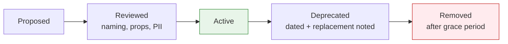

> ✅ **Best Practice:** Treat the tracking plan as code: version it, review changes via pull request, and validate events against it automatically. Analytics that is "documented in someone's head" does not survive team growth.

> ⚠️ **Common Pitfall:** Letting any engineer add any event with no review. Within months you have `signup`, `sign_up`, `SignUp`, `user_registered`, and `registration_complete`, all meaning the same thing, and no report can be trusted. Governance is cheap; cleanup is not.

---

## 16. Data Quality

Analytics is only as trustworthy as its data. This section catalogs the failure modes and how to defend against them.

### 16.1 The common failure modes

| Problem | Symptom | Typical cause | Defense |
|---|---|---|---|
| **Missing events** | Counts lower than reality | Buffer not flushed, ad-blockers, code path not instrumented | Flush on unload; server-side tracking; coverage tests |
| **Duplicate events** | Counts inflated | Retries without idempotency, double-firing handlers | Client-side `event_id` + server dedup ([Section 3.6](#36-deduplication-and-event-ids)) |
| **Late events** | Yesterday's numbers change today | Offline/queued events arriving late | Use event (client) timestamp; allow a "lookback" reprocessing window |
| **Timezone issues** | Daily counts shift by hours | Mixing UTC and local time | Store everything in UTC; convert only at display |
| **Clock skew** | Events "in the future" or misordered | Wrong device clocks | Record server time too; correct via skew offset |
| **Null / missing values** | Broken segments, "(not set)" rows | Optional props omitted, races | Required-property enforcement; sensible defaults |
| **Schema drift** | New property types break queries | Unreviewed event changes | Schema validation in CI / at ingestion |

### 16.2 Timezones and clock skew in depth

> 📌 **Important Note - store in UTC, display in local.** Every timestamp in your pipeline should be UTC. Convert to a user's or analyst's local timezone *only* at the presentation layer. Mixing zones at storage time is a permanent, hard-to-unwind corruption.

**Clock skew** correction pattern:

```javascript
// On the client, send when the event was created (client clock).
// On the server, also record receipt time (trusted clock).
// skew = server_received - client_sent  (per device, smoothed)
// corrected_event_time = client_event_time + skew
```

This keeps the *true ordering and relative timing* from the client while anchoring to a trusted absolute clock.

### 16.3 Late events and reprocessing

Because of offline mode, an event from "yesterday" can arrive "today." Two implications:

- **Yesterday's metrics are not final** until your lookback window closes (commonly 24-72 hours).
- Your warehouse jobs should **reprocess** recent days, not only the current one, so late arrivals land in the correct (event-time) day.

### 16.4 Schema validation and monitoring

```javascript
// Example: validate an event against a schema before sending
const checkoutSchema = {
  required: ["cart_value", "currency"],
  types: { cart_value: "number", currency: "string", item_count: "number" }
};

function validate(event, props, schema) {
  for (const key of schema.required) {
    if (props[key] == null) throw new Error(`Missing required: ${key}`);
  }
  for (const [key, type] of Object.entries(schema.types)) {
    if (props[key] != null && typeof props[key] !== type) {
      throw new Error(`Wrong type for ${key}: expected ${type}`);
    }
  }
}
```

**Monitoring** to put in place:

- **Volume alerts:** event volume drops >X% versus the same weekday last week → likely a broken release.
- **Schema alerts:** a new/unexpected property or type appears → drift.
- **Null-rate alerts:** a required property's null rate spikes → instrumentation bug.
- **Freshness alerts:** the pipeline has not received events in N minutes → ingestion outage.

> 💡 **Pro Tip:** The most valuable single alert is "event volume dropped sharply." It catches the most damaging and most common failure (a release that broke tracking) before stakeholders notice their dashboards went flat.

> ⚠️ **Common Pitfall:** Discovering a tracking bug *weeks* later, by which point the data is permanently incomplete (you cannot retroactively capture events that were never sent). Monitoring exists precisely to shrink that detection gap to hours.

---

## 17. Privacy and Compliance

Analytics collects data about people, which makes it subject to privacy law and ethical obligation. Non-compliance carries real fines (GDPR penalties reach into the tens of millions of euros) and real reputational cost.

> 📌 **Important Note:** This section is general guidance for engineers, **not legal advice.** Always confirm specifics with your organization's legal/privacy team and your [internal standards](#21-our-analytics-standards).

### 17.1 Key regulations

| Regulation | Region | Core requirement (simplified) |
|---|---|---|
| **GDPR** | EU / EEA | Lawful basis (often consent) before processing personal data; rights to access, delete, port; data minimization |
| **CCPA / CPRA** | California | Right to know, delete, and opt out of "sale/sharing" of personal info |
| Others (LGPD, PIPEDA, etc.) | Brazil, Canada, ... | Broadly similar consent + rights frameworks |

### 17.2 Cookie consent and consent management

Many analytics identifiers rely on cookies/storage, which in the EU generally require **prior consent**.

- A **Consent Management Platform (CMP)** presents the consent banner and records the user's choices.
- Your SDK must **respect** that choice: do not set tracking cookies or send identified events until consent is granted (for the categories that require it).
- **Consent mode**: some platforms support a degraded, cookieless "no-consent" mode that collects only aggregate, non-identifying signals.

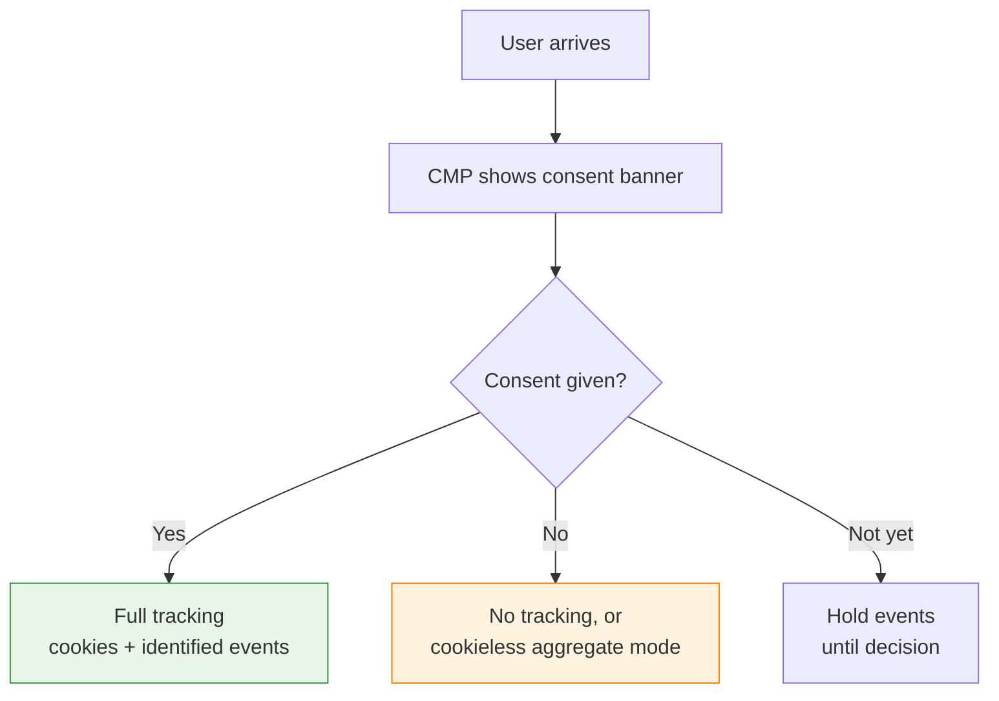

### 17.3 PII and data minimization

- **PII** (see [Section 8.5](#85-avoid-pii-in-events)) should be kept out of analytics by default.
- **Data minimization** (a GDPR principle): collect only what you actually need for a defined purpose. "We might want it someday" is not a lawful basis.

### 17.4 Retention policies

You should not keep raw personal data forever. A **retention policy** defines how long each data class is kept before deletion or anonymization.

| Data class | Example retention |
|---|---|
| Raw identified events | 14-26 months (GA4 caps at 14 months for some data) |
| Aggregated/anonymized metrics | Often indefinite (no longer personal) |
| Consent records | Kept as proof, per legal guidance |

### 17.5 Honoring user rights

Build the operational ability to:

- **Delete** a user's data on request (right to erasure). Your `user_id` mapping makes this feasible; PII scattered through event properties makes it a nightmare, another reason to keep PII out.
- **Export** a user's data (right to access/portability).
- **Opt out** of tracking and have that choice persist.

> ✅ **Best Practice:** Design for deletion from day one. If every personal record is keyed by an opaque `user_id`, a deletion request is "delete rows where user_id = X." If PII is smeared across raw event text, it is nearly impossible. Privacy-by-design is cheaper than privacy-by-cleanup.

> ⚠️ **Common Pitfall:** Putting an email or name directly into an event property "just for convenience." It becomes PII you must now find, secure, delete on request, and disclose in audits, across every downstream tool the event was forwarded to.

---

## 18. Implementation Best Practices

Where and how you fire events matters as much as what you fire. The big architectural choice is **client-side vs server-side** tracking.

### 18.1 Client-side vs server-side tracking

| | Client-side (frontend/mobile) | Server-side (backend/API) |
|---|---|---|
| **Fires from** | Browser/app | Your server |
| **Good for** | UI interactions, page/screen views, clicks | Transactions, payments, anything that must be reliable |
| **Reliability** | Lower (ad-blockers, network, closed tabs) | Higher (you control it) |
| **Context richness** | Rich UI context, device, UTMs | Authoritative business data |
| **Privacy** | Exposes keys to client; blockable | Keys hidden; harder to block |
| **Latency** | Immediate | Slight (server round-trip) |

> ✅ **Best Practice - hybrid tracking.** Use **client-side** for UI/engagement (clicks, views, scrolls) and **server-side** for the events you cannot afford to lose (`order_completed`, `subscription_purchased`, `payment_failed`). Critical money events fired from the server are immune to ad-blockers and closed tabs.

### 18.2 Frontend

- Initialize the SDK once, early.
- Fire `page`/`screen` on every route change (manually in SPAs, see [Section 2.3](#23-page-concepts)).
- Wrap `track` in a thin helper that enforces required properties and naming ([Section 8.3](#83-required-vs-optional-properties)).
- Flush the buffer on `pagehide`/`visibilitychange`.

### 18.3 Backend / API / server-side tracking

- Fire revenue and state-change events from the server where the source of truth lives.
- Pass through the `anonymous_id`/`user_id` from the client so server events stitch to the same user.
- Use the server clock for `timestamp_server`, but still respect client `event_id` for dedup if relaying client events.

```javascript
// Server-side critical event (Node-style pseudocode)
app.post("/api/checkout/complete", async (req, res) => {
  const order = await completeOrder(req.body);
  analytics.track({
    userId: req.user.id,                 // authoritative identity
    event: "order_completed",
    properties: {
      order_id: order.id,
      value: order.total,                // trusted, from your DB
      currency: order.currency,
      item_count: order.items.length
    }
  });
  res.json({ ok: true });
});
```

### 18.4 Mobile

- Handle background/foreground for sessions ([Section 10.4](#104-background-app-behavior-mobile)).
- Persist the queue to disk for offline support.
- Respect OS-level tracking permissions (e.g. App Tracking Transparency).

### 18.5 Offline tracking

- Persist unsent events durably; upload on reconnect.
- Keep **client timestamps** so late uploads land on the correct day ([Section 16.3](#163-late-events-and-reprocessing)).

### 18.6 Feature flags and experiments

- When running an A/B test, attach the **variant** the user saw as a property (or user property): `experiment_id`, `variant`.
- This lets you slice every downstream metric by variant, which is the entire point of experimentation.

```json
{
  "event": "checkout_completed",
  "properties": { "value": 49.0, "currency": "USD" },
  "user_properties": {
    "experiment_one_step_checkout": "variant_b"
  }
}
```

> 💡 **Pro Tip:** Record the experiment exposure (`experiment_viewed`) as its own event, not just as a property on downstream events. You need to know who was *exposed* to a variant, including those who did not convert, to compute the experiment correctly.

> ⚠️ **Common Pitfall:** Tracking only client-side and then being surprised that ~10-30% of money events are missing (ad-blockers, privacy browsers, network drops). For revenue, track server-side. The finance team will not accept "ad-blockers ate our revenue numbers."

---

## 19. Debugging Analytics

When a number looks wrong, debug systematically along the [lifecycle](#16-the-analytics-lifecycle): is the event generated, sent, received, processed, stored, and shown correctly?

### 19.1 Browser DevTools: the Network tab

The fastest first check. Filter the Network tab for your analytics endpoint (e.g. requests to `/v1/track`, `/v1/batch`, `collect`, or your tool's domain) and inspect:

- Is a request fired at all when you perform the action? (No request → event not generated or SDK not loaded.)
- What is the **payload**? Confirm the event name, properties, `user_id`, `session_id` are correct.
- What is the **response status**? `200` is good; `4xx` means a malformed/unauthorized request; nothing means it was blocked or never sent.

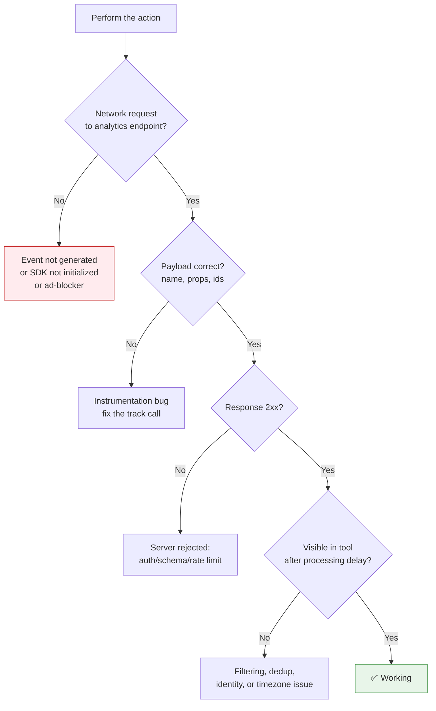

### 19.2 SDK debug mode

Most SDKs have a debug/verbose mode that logs every captured event to the console before sending:

```javascript
analytics.init(WRITE_KEY, { debug: true });
// Console will print each enriched event payload as it is tracked.
```

This shows you the *enriched* event (with IDs, session, UTMs) so you can confirm the SDK attached everything correctly ([Section 4](#4-event-lifecycle)).

### 19.3 Server logs

For server-side events, log the outbound analytics call (event name, user, key properties) at a debug level. This confirms the backend actually fired the event and with what payload, independent of any UI.

### 19.4 Common implementation mistakes

| Symptom | Likely cause |
|---|---|
| Event never appears | SDK not initialized; ad-blocker; wrong write key; event name typo |
| Event appears twice | Handler bound twice; retry without idempotency; React strict-mode double-invoke in dev |
| Right count, wrong user | `identify` not called, or called with the wrong/unstable ID |
| UTMs missing | Not persisted at landing; lost on redirect; stripped by SPA routing |
| Numbers off by hours | Timezone mixing (UTC vs local) |
| Last action before navigation missing | Buffer not flushed on unload |
| Properties are `null`/"(not set)" | Property omitted or set after the event fired (race condition) |

### 19.5 Validation checklist (per event)

- [ ] A network request fires exactly once per user action.
- [ ] Event name matches the tracking plan (correct casing, snake_case).
- [ ] All required properties are present and correctly typed.
- [ ] `user_id` (if logged in) and `session_id` are attached.
- [ ] UTMs/campaign are present when arriving from a tagged link.
- [ ] Response is `2xx`.
- [ ] The event shows up in the analytics tool after the processing delay.
- [ ] No duplicate appears for a single action.

> 💡 **Pro Tip:** Reproduce in an **incognito window with extensions disabled** to rule out ad-blockers and stale cookies. A surprising share of "analytics is broken" reports are a blocker on the developer's own machine.

> ⚠️ **Common Pitfall:** Concluding "the event is broken" because it is not in the dashboard *yet*. Most tools have a processing delay (seconds to hours). Confirm the **request succeeded in the Network tab** first; that proves the client side works regardless of dashboard lag.

---

## 20. Real Project Examples

End-to-end walkthroughs showing every event, its properties, user properties, session, and attribution, from first touch to dashboard. Use these as templates.

### 20.1 Example A: SaaS signup from Google Ads to paid subscription

**Journey:** User clicks a Google Ad → lands → signs up → verifies email → buys a subscription.

```
Google Ads click  →  Landing  →  Signup  →  Email verified  →  Subscription purchased
```

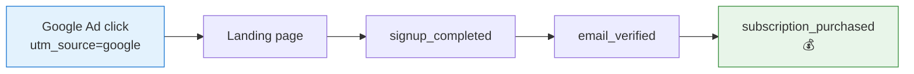

**Events fired, in order:**

```json
// 1. Landing (anonymous). UTMs captured and persisted here.
{
  "event": "page_viewed",
  "anonymous_id": "d-7af3",
  "session_id": "s-001",
  "properties": { "path": "/promo/summer" },
  "context": { "campaign": { "source": "google", "medium": "cpc", "name": "summer_sale", "term": "project_tool" } }
}

// 2. Signup completed -> identify + alias here
{
  "event": "signup_completed",
  "anonymous_id": "d-7af3",
  "user_id": "usr_5501",
  "session_id": "s-001",
  "properties": { "method": "email" }
}

// 3. Email verified
{
  "event": "email_verified",
  "user_id": "usr_5501",
  "session_id": "s-001"
}

// 4. Subscription purchased (fired SERVER-SIDE for reliability)
{
  "event": "subscription_purchased",
  "user_id": "usr_5501",
  "properties": { "plan": "pro", "billing_period": "monthly", "value": 29.0, "currency": "USD", "is_trial_conversion": false }
}
```

**User properties after this journey:**

```json
{
  "user_id": "usr_5501",
  "plan": "pro",
  "signup_date": "2026-06-29",
  "acquisition_source": "google",
  "acquisition_medium": "cpc",
  "first_touch_campaign": "summer_sale"
}
```

| Aspect | Value |
|---|---|
| Session | One session `s-001` spans landing → purchase (within 30 min) |
| First touch | `google / cpc / summer_sale` |
| Last touch | same (single-session journey) |
| Attribution (last-touch) | 100% to Google CPC |
| Dashboard view | Acquisition funnel: Landing → Signup → Verified → Purchased, with conversion % per step and revenue by source |

### 20.2 Example B: E-commerce checkout

**Journey:** Browse → add to cart → checkout → pay → order complete.

```json
// Events (key ones)
{ "event": "product_viewed",   "properties": { "product_id": "sku_42", "price": 49.0, "currency": "USD" } }
{ "event": "product_added_to_cart", "properties": { "product_id": "sku_42", "quantity": 2, "cart_value": 98.0, "currency": "USD" } }
{ "event": "checkout_started", "properties": { "cart_value": 98.0, "item_count": 2, "currency": "USD" } }
{ "event": "payment_submitted","properties": { "payment_method": "card", "cart_value": 98.0, "currency": "USD" } }
{ "event": "order_completed",  "properties": { "order_id": "ord_771", "value": 98.0, "currency": "USD", "item_count": 2 } }  // SERVER-SIDE
```

| Aspect | Value |
|---|---|
| Funnel | `product_viewed → product_added_to_cart → checkout_started → payment_submitted → order_completed` |
| Critical event | `order_completed` fired server-side (revenue must not be lost) |
| Key properties | `value` + `currency` together; `item_count`; `payment_method` |
| Dashboard | Checkout funnel with drop-off per step; revenue and AOV (average order value = revenue / orders) |

> 🧪 **Average Order Value:** if 3,600 orders produced 352,800 USD, AOV = 352,800 / 3,600 = **98 USD**.

### 20.3 Example C: Mobile app onboarding

**Journey:** Install → first open → onboarding steps → activation.

```json
{ "event": "app_installed" }                                  // attributed to install source
{ "event": "app_opened", "properties": { "is_first_open": true } }
{ "event": "onboarding_step_viewed", "properties": { "step": 1, "step_name": "welcome" } }
{ "event": "onboarding_step_viewed", "properties": { "step": 2, "step_name": "connect_account" } }
{ "event": "onboarding_completed", "properties": { "steps_total": 3, "duration_seconds": 74 } }
{ "event": "first_project_created" }                          // the activation event
```

| Aspect | Value |
|---|---|
| Session | First session begins at `app_opened`; background handling matters ([Section 10.4](#104-background-app-behavior-mobile)) |
| Activation | `first_project_created` is the behavioral activation event ([Section 12.3](#123-behavioral-cohorts)) |
| Funnel | Onboarding step funnel reveals which step loses users |
| Dashboard | Onboarding completion rate; activation rate; D1/D7 retention split by "completed onboarding" cohort |

### 20.4 Example D: Subscription renewal (and churn)

**Journey:** Active subscription → renewal attempt → success or failure → possible churn.

```json
{ "event": "subscription_renewal_attempted", "user_id": "usr_5501", "properties": { "plan": "pro", "value": 29.0, "currency": "USD" } }  // SERVER-SIDE
{ "event": "subscription_renewed",           "user_id": "usr_5501", "properties": { "plan": "pro", "value": 29.0, "currency": "USD", "renewal_count": 6 } }
// OR, on failure:
{ "event": "subscription_payment_failed",    "user_id": "usr_5501", "properties": { "plan": "pro", "reason": "card_declined" } }
{ "event": "subscription_canceled",          "user_id": "usr_5501", "properties": { "plan": "pro", "reason": "voluntary", "tenure_months": 6 } }
```

| Aspect | Value |
|---|---|
| Source of truth | All renewal/billing events fired **server-side** |
| Key metrics | MRR, churn rate (`canceled / active_at_start`), renewal success rate |
| User property updates | `plan` → `canceled`, `churn_date` set, `lifetime_value` updated |
| Dashboard | MRR movement (new, expansion, churned), churn cohort analysis, failed-payment recovery funnel |

> 💡 **Pro Tip:** Distinguish **voluntary churn** (user chose to cancel) from **involuntary churn** (payment failed). They have completely different fixes: voluntary churn is a product/value problem; involuntary churn is a payments/dunning problem. The `reason` property is what lets you tell them apart.

---

## 21. Our Analytics Standards

> 📌 **This section is intentionally a template.** Everything below is a placeholder for *your organization's* concrete decisions. Replace each `TODO` with your real standard. Keep this section self-contained so teams can update it without touching the rest of the handbook.

> **TODO:** Replace this entire section with your organization's analytics implementation details.

### 21.1 Platforms

> **TODO:** List the analytics platform(s) in use.

| Purpose | Tool | Owner |
|---|---|---|
| Product analytics | `TODO (e.g. Amplitude / Mixpanel / PostHog)` | `TODO` |
| Web/marketing analytics | `TODO (e.g. GA4)` | `TODO` |
| CDP / data routing | `TODO (e.g. Segment)` | `TODO` |
| Data warehouse | `TODO (e.g. BigQuery / Snowflake)` | `TODO` |

### 21.2 Conventions and core decisions

| Decision | Our standard |
|---|---|
| **Event naming convention** | `TODO (e.g. snake_case, object_action, past tense)` |
| **Attribution model** | `TODO (e.g. position-based; data-driven in GA4)` |
| **Session timeout** | `TODO (e.g. 30 minutes)` |
| **Identity strategy** | `TODO (identify on login; alias once at signup)` |
| **User ID strategy** | `TODO (opaque internal id, never email)` |
| **Required event properties (global)** | `TODO (e.g. app_version, platform, session_id)` |
| **Client vs server split** | `TODO (UI client-side; revenue server-side)` |

### 21.3 Ownership and governance

> **TODO:** Define who owns events and how changes are reviewed.

- Event ownership model: `TODO`
- Tracking plan location: `TODO (link)`
- Review/approval process for new events: `TODO`

### 21.4 Links and resources

> **TODO:** Fill in internal links.

- Dashboards: `TODO (links)`
- Tracking plan / event catalog: `TODO (link)`
- Internal analytics docs: `TODO (link)`
- Data warehouse access: `TODO (link)`
- ETL/ELT process docs: `TODO (link)`

### 21.5 QA checklist (ours)

> **TODO:** Replace with your organization's required QA gates.

- [ ] `TODO`
- [ ] `TODO`
- [ ] `TODO`

---

## 22. Developer Checklist

Use this before shipping any analytics change. (Your team's version lives in [Section 21.5](#215-qa-checklist-ours).)

### 22.1 Before shipping a new event

- [ ] **Event exists** in the tracking plan (or has been added and reviewed).
- [ ] **Naming reviewed** against convention (snake_case, object_action, past tense, no reserved names).
- [ ] **Required properties added** and correctly typed.
- [ ] **No PII** in the event name or properties.
- [ ] **No unbounded high-cardinality property** used as a reporting dimension.
- [ ] **UTM/attribution tested** if this event is part of an acquisition flow.
- [ ] **Identity verified** (`user_id` attached when logged in; anonymous handled).
- [ ] **Session attached** and behaves correctly across navigation/background.
- [ ] **Debug verified** (SDK debug mode shows the enriched payload; Network tab shows a 2xx).
- [ ] **Dashboard verified** (the event appears and populates the intended chart/funnel).
- [ ] **Critical/revenue events fire server-side**, not only client-side.
- [ ] **Owner assigned** and documented.
- [ ] **QA approved.**

### 22.2 Before shipping an experiment

- [ ] Exposure event (`experiment_viewed`) fires for everyone bucketed.
- [ ] `experiment_id` and `variant` attached to downstream metrics.
- [ ] Both variants verified end-to-end.

### 22.3 Before deprecating an event

- [ ] Marked deprecated in the tracking plan with date + replacement.
- [ ] Downstream dashboards/queries migrated.
- [ ] Grace period observed before removal.

---

## 23. FAQ

Practical answers to the questions developers ask most.

**1. What is the difference between First Touch and First Visit?**
First *touch* is the first marketing interaction that earned the user's attention (often an ad click/impression). First *visit* is the first actual session on your property. They usually coincide but not always: a podcast ad (touch) can precede a later direct visit. See [Section 2.4](#24-timing-concepts).

**2. What is the difference between a Session and a User?**
A user is a person (identified by `user_id`). A session is a single visit by that person. One user has many sessions over their lifetime. See [Sections 2.1](#21-user-concepts) and [10](#10-sessions).

**3. Why are events duplicated?**
Usually a retry that succeeded but whose acknowledgement was lost, so the client retried again, or a handler bound twice (including React strict-mode double-invocation in dev). Fix with a client-generated `event_id` and server-side deduplication. See [Section 3.6](#36-deduplication-and-event-ids).

**4. Why is my attribution changing for past periods?**
If you use data-driven attribution, the model retrains and redistributes credit. Late-arriving touches and conversion windows also shift historical credit. This is expected behavior, not a bug. See [Section 5.7](#57-data-driven-attribution).

**5. Why isn't my event visible in the dashboard?**
Check, in order: did a network request fire (DevTools)? Was the response 2xx? Has the processing delay elapsed? Is a filter/segment hiding it? Is identity/timezone misrouting it? See [Section 19](#19-debugging-analytics).

**6. When should I use a user property vs an event property?**
User property = a fact about the *person* (plan, signup date), mutable, reflects latest value. Event property = context of *this occurrence* (cart value on this purchase), frozen. Ask "is this about the clicker or the click?" See [Section 2.7](#27-event-concepts).

**7. What should never be tracked?**
PII (emails, names, phone, full address, payment numbers, precise location) unless you have a deliberate compliant reason and controls; passwords/secrets ever; unbounded values as reporting dimensions. See [Sections 8.5](#85-avoid-pii-in-events) and [17](#17-privacy-and-compliance).

**8. Should I track on the client or the server?**
Client for UI/engagement, server for anything you cannot lose (revenue, state changes). Hybrid is the norm. See [Section 18.1](#181-client-side-vs-server-side-tracking).

**9. Why is my user counted as "new" again?**
Their `device_id` likely reset (cleared storage, private mode, new device) and they were not identified, so stitching could not link them. See [Section 9](#9-user-identification).

**10. Why do two tools report different session counts?**
They define sessions differently (timeout, campaign-restart, bot filtering, consent). A 5-10% gap is normal. Compare trends within one tool. See [Section 6](#6-industry-standards).

**11. What session timeout should I use?**
30 minutes unless you have a specific reason. Shorter for high-frequency utilities, longer for long-form content. See [Section 10.3](#103-custom-timeout).

**12. How do I track UTMs in a single-page app?**
Read UTMs from the landing URL on first load and persist them immediately; SPA route changes drop the query string, so you must capture before navigation. Fire `page` manually on route changes. See [Sections 2.5](#25-traffic-concepts-utm-parameters) and [2.3](#23-page-concepts).

**13. Why are my UTMs missing after a redirect?**
Redirects (auth, link shorteners) often strip query parameters. Capture UTMs before the redirect, or carry them through it. See [Section 2.5](#25-traffic-concepts-utm-parameters).

**14. What is a bounce, exactly?**
Classically a single-page session with no interaction. Modern tools (GA4) define it as a non-engaged session (under 10s, no conversion, fewer than 2 views). See [Section 2.2](#22-session-concepts).

**15. What is the difference between classic and rolling retention?**
Classic = active on exactly day N; rolling = active on day N or later. Rolling is more forgiving and suits infrequent-use products. See [Section 13.3](#133-classic-vs-rolling-retention).

**16. What does DAU/MAU tell me?**
Stickiness, roughly how many days a month the average user shows up. 20%+ is solid for daily-habit products. See [Section 13.4](#134-stickiness-dau-wau-mau-and-the-ratio).

**17. What is an activation event?**
The earliest user action most correlated with long-term retention (e.g. "create first project"). Find it with behavioral cohorts, then drive onboarding toward it. See [Section 12.3](#123-behavioral-cohorts).

**18. How many properties should an event have?**
Enough to answer your questions, typically 5-15 for a rich event. If it has 40, it is doing too much. See [Section 8.2](#82-how-many-properties).

**19. What is high cardinality and why avoid it?**
Cardinality = number of distinct values. Unbounded values (raw queries, full URLs) make terrible chart dimensions. Store raw if needed, but group by a normalized low-cardinality field. See [Section 8.4](#84-avoid-high-cardinality-properties).

**20. Why use snake_case?**
It avoids casing fragmentation (`videoPlayed` vs `VideoPlayed`), is SQL/URL friendly, and reads consistently. The real rule is consistency; pick one and enforce it. See [Section 7.2](#72-snake_case).

**21. Should I version event names?**
Prefer adding properties or a `schema_version` over renaming. Only version the name when meaning fundamentally changed. See [Section 7.5](#75-versioning).

**22. Client timestamp or server timestamp, which is correct?**
Client is closer to the real action but trusts the device clock; server is reliable but delayed by offline/queueing. Record both and correct for skew. See [Section 16.2](#162-timezones-and-clock-skew-in-depth).

**23. Why did yesterday's numbers change today?**
Late-arriving (offline) events landed on yesterday's event-time day, and reprocessing updated it. Daily numbers are final only after the lookback window. See [Section 16.3](#163-late-events-and-reprocessing).

**24. What timezone should I store timestamps in?**
Always UTC; convert to local only at display. See [Section 16.2](#162-timezones-and-clock-skew-in-depth).

**25. What is identity stitching?**
Linking anonymous pre-signup behavior to the `user_id` after `identify`, so the whole journey is one person. See [Section 9.2](#92-identity-stitching).

**26. What is aliasing and when do I call it?**
Aliasing merges an anonymous ID with a new `user_id`, typically once at signup. Calling it repeatedly or on shared devices can wrongly merge people. See [Section 9.3](#93-aliasing).

**27. How does cross-device tracking work?**
Each device must be identified with the same `user_id`; anonymous-only devices cannot be stitched. See [Section 9.4](#94-cross-device-tracking).

**28. Should I use email as the user ID?**
No. Use an opaque, immutable internal ID. Emails change, are PII, and are shared. See [Section 9.5](#95-identity-model-summary).

**29. What is the difference between an exit page and a bounce?**
Exit page = the last page of *any* session. Bounce = a single-page session with no engagement. See [Section 2.3](#23-page-concepts).

**30. Why is my last event before navigation missing?**
The buffer was not flushed before the page unloaded. Flush on `pagehide`/`visibilitychange`. See [Section 3.3](#33-buffering-and-batch-uploads).

**31. Why are ad-blockers eating my events?**
Client-side analytics requests are commonly blocked. Track critical events server-side to bypass this. See [Section 18.1](#181-client-side-vs-server-side-tracking).

**32. How do I track an A/B test correctly?**
Fire an exposure event for everyone bucketed, and attach `experiment_id` + `variant` to downstream metrics. See [Section 18.6](#186-feature-flags-and-experiments).

**33. What is the difference between ROAS and ROI?**
ROAS is gross revenue per ad dollar (ignores costs); ROI is net return after costs. A high ROAS can still be unprofitable. See [Section 14.2](#142-business-and-revenue-metrics).

**34. What is a good LTV:CAC ratio?**
A common SaaS rule of thumb is 3:1 or higher. Below 1:1 you lose money per customer. See [Section 14.2](#142-business-and-revenue-metrics).

**35. What is the difference between MRR and ARR?**
MRR is monthly recurring revenue; ARR is MRR × 12. See [Section 14.2](#142-business-and-revenue-metrics).

**36. What is the difference between a static and a dynamic cohort?**
Static = fixed membership frozen at creation; dynamic = rule-based, recomputed continuously. See [Section 12](#12-cohorts).

**37. What is a conversion window and why does it matter?**
The time allowed to complete a funnel/goal. Too short undercounts real conversions; too long over-attributes. Match it to your buying cycle. See [Section 11.3](#113-funnel-analysis-nuances).

**38. Strict vs relaxed funnel?**
Strict requires steps in exact order with nothing between; relaxed allows other events between steps. Choose deliberately. See [Section 11.3](#113-funnel-analysis-nuances).

**39. Why is "active user" so important to define carefully?**
Because DAU/MAU and retention all depend on it. "Opened the app" measures notifications, not value; pick a meaningful action. See [Sections 2.1](#21-user-concepts) and [13.4](#134-stickiness-dau-wau-mau-and-the-ratio).

**40. What is the difference between voluntary and involuntary churn?**
Voluntary = user chose to cancel (a value problem); involuntary = payment failed (a dunning problem). Different fixes. See [Section 20.4](#204-example-d-subscription-renewal-and-churn).

**41. Do I need consent before tracking?**
In the EU, generally yes for cookie/identifier-based tracking. Respect the CMP's recorded choice. See [Section 17.2](#172-cookie-consent-and-consent-management).

**42. How long should I keep analytics data?**
Per your retention policy and law; raw identified data is often capped at 14-26 months, aggregates can be kept longer. See [Section 17.4](#174-retention-policies).

**43. How do I handle a user's deletion request?**
Delete by `user_id` across all stores and downstream tools. This is feasible only if you kept PII out and keyed everything by `user_id`. See [Section 17.5](#175-honoring-user-rights).

**44. Why should raw events be immutable?**
So you can reprocess after fixing a transformation bug. "Raw is sacred." See [Section 3.7](#37-from-storage-to-warehouse-to-dashboard).

**45. How do I prevent naming chaos as the team grows?**
Governance: a reviewed tracking plan treated as code, with owners per domain. See [Section 15](#15-event-taxonomy).

**46. One event with a property, or many events?**
Prefer one event with a discriminating property (`button_clicked` + `button_name`) over many near-identical events, without over-collapsing genuinely distinct actions. See [Section 7.7](#77-prefixes).

**47. What is the single most valuable monitoring alert?**
"Event volume dropped sharply," it catches broken releases before stakeholders notice. See [Section 16.4](#164-schema-validation-and-monitoring).

**48. Why do I see "(not set)" / null in reports?**
A property was omitted or set after the event fired (race). Enforce required properties and set context before tracking. See [Section 16](#16-data-quality).

**49. How do I debug "analytics is broken" fastest?**
Open DevTools Network in incognito (extensions off), perform the action, and inspect the request and response. See [Section 19](#19-debugging-analytics).

**50. Where do I document our team's specific choices?**
In [Section 21, "Our Analytics Standards,"](#21-our-analytics-standards) which is the customizable template for exactly this.

---

## 24. Appendix

### 24.1 Complete glossary (A-Z)

| Term | Short definition |
|---|---|
| **AARRR** | Pirate Metrics: Acquisition, Activation, Retention, Revenue, Referral |
| **Active user** | User who took a meaningful action in a time window |
| **Activation** | A user's first valuable experience ("aha moment") |
| **Acquisition** | Getting users to your product |
| **Alias** | Explicitly merge two identities into one |
| **Anonymous ID** | Identifier for an unidentified user/device |
| **ARPU** | Average Revenue Per User |
| **ARR** | Annual Recurring Revenue (MRR × 12) |
| **Attribution** | Assigning conversion credit to touchpoints |
| **Bounce** | Single-page, non-engaged session |
| **CAC** | Customer Acquisition Cost |
| **Cardinality** | Number of distinct values a property can take |
| **Client timestamp** | Time the device claims an event occurred |
| **Cohort** | Group of users sharing a characteristic |
| **Conversion rate** | Conversions ÷ users (or sessions) |
| **CTR** | Click-Through Rate |
| **DAU / WAU / MAU** | Daily / Weekly / Monthly Active Users |
| **Data-driven attribution** | ML-assigned credit based on incremental contribution |
| **Deduplication** | Dropping duplicate events by ID |
| **Device ID** | Per-device/browser identifier |
| **Engaged session** | Session with meaningful interaction |
| **Event** | A record that something happened |
| **Event ID** | Unique idempotency key per event |
| **Event property** | Context of a single event occurrence |
| **Exit page** | Last page of a session |
| **First touch** | First marketing interaction ever |
| **First visit** | First session ever |
| **Funnel** | Ordered steps toward a goal, with drop-off |
| **Identify** | Link a device to a known `user_id` |
| **Identity stitching** | Connecting anonymous and known identities |
| **Landing page** | First page of a session |
| **Last touch** | Most recent interaction before conversion |
| **Linear attribution** | Equal credit to all touchpoints |
| **LTV** | Lifetime Value |
| **MRR** | Monthly Recurring Revenue |
| **Page view** | A web page was viewed |
| **PII** | Personally Identifiable Information |
| **Position-based attribution** | 40/20/40 first/middle/last credit |
| **Referrer** | Source URL that sent the user |
| **Retention** | Whether users return over time |
| **ROAS** | Return on Ad Spend |
| **ROI** | Return on Investment |
| **Rolling retention** | Active on day N or later |
| **Screen view** | Mobile equivalent of a page view |
| **Server timestamp** | Time the server received the event |
| **Session** | A single visit (events grouped in time) |
| **Session timeout** | Inactivity period that ends a session (default 30 min) |
| **Stickiness** | DAU ÷ MAU |
| **Time-decay attribution** | More credit to recent touches |
| **Time on page** | Duration spent on a page |
| **User ID** | Stable internal identifier for a person |
| **User property** | An attribute of the person |
| **UTM** | URL tags identifying traffic source/medium/campaign |
| **Visitor** | A unique device/browser that visited |

### 24.2 Reference tables

**Attribution models at a glance:**

| Model | Credit rule | Best for |
|---|---|---|
| First-touch | 100% first | Awareness/discovery |
| Last-touch | 100% last | Short cycles |
| Linear | Equal | Long multi-touch journeys |
| Position-based | 40/20/40 | Balanced default |
| Time-decay | Recent-weighted | Building-momentum cycles |
| Data-driven | ML-learned | High-volume mature teams |

**Active-user windows:**

| Metric | Window |
|---|---|
| DAU | 1 day |
| WAU | 7 days |
| MAU | 28-30 days |

### 24.3 Event property examples

| Event | Required properties | Recommended properties |
|---|---|---|
| `signup_completed` | `method` | `referral_source` |
| `checkout_started` | `cart_value`, `currency` | `item_count`, `coupon_code` |
| `order_completed` | `order_id`, `value`, `currency` | `item_count`, `payment_method` |
| `subscription_purchased` | `plan`, `value`, `currency` | `billing_period`, `is_trial_conversion` |
| `video_played` | `video_id` | `position_seconds`, `quality` |

### 24.4 Sample JSON payloads

Minimal:

```json
{ "event": "button_clicked", "properties": { "button_name": "Checkout", "page": "Cart" } }
```

Identify call:

```json
{
  "type": "identify",
  "user_id": "usr_8c1e0b",
  "traits": { "plan": "pro", "signup_date": "2026-06-01", "company_size": "50-100" }
}
```

Batched upload:

```json
{
  "batch": [
    { "event": "page_viewed", "event_id": "evt_1", "properties": { "path": "/home" } },
    { "event": "search_performed", "event_id": "evt_2", "properties": { "results_count": 12 } }
  ],
  "sent_at": "2026-06-29T10:13:00Z"
}
```

### 24.5 Common SQL patterns

```sql
-- Daily Active Users (meaningful action = any tracked event today)
SELECT DATE(event_time) AS day, COUNT(DISTINCT user_id) AS dau
FROM events
WHERE event_time >= CURRENT_DATE - INTERVAL '30 days'
GROUP BY day
ORDER BY day;

-- Simple D7 retention for a signup cohort
WITH cohort AS (
  SELECT user_id, DATE(MIN(event_time)) AS join_day
  FROM events GROUP BY user_id
)
SELECT c.join_day,
       COUNT(DISTINCT c.user_id) AS cohort_size,
       COUNT(DISTINCT CASE
         WHEN DATE(e.event_time) = c.join_day + INTERVAL '7 days'
         THEN e.user_id END) AS retained_d7
FROM cohort c
LEFT JOIN events e ON e.user_id = c.user_id
GROUP BY c.join_day
ORDER BY c.join_day;
```

### 24.6 Recommended reading

- *Lean Analytics* - Croll & Yoskovitz (which metrics matter at each stage).
- *Trustworthy Online Controlled Experiments* - Kohavi, Tang & Xu (experimentation done right).
- Segment Spec documentation (the canonical `track`/`identify`/`page`/`group`/`alias` model).
- Amplitude and Mixpanel guides on event taxonomy and behavioral cohorts.
- GA4 documentation on sessions, events, and attribution.
- Dave McClure's original "Startup Metrics for Pirates" (AARRR).

### 24.7 Implementation checklist (condensed)

- [ ] Tracking plan exists and is the source of truth.
- [ ] Naming convention chosen and enforced in a wrapper.
- [ ] Global required properties on every event.
- [ ] Identity strategy (`identify`/`alias`, opaque `user_id`) implemented.
- [ ] Sessions configured (timeout, mobile background handling).
- [ ] UTMs captured and persisted at landing.
- [ ] Critical/revenue events fire server-side.
- [ ] Dedup via client `event_id`.
- [ ] Timestamps in UTC; both client and server recorded.
- [ ] Consent respected before tracking where required.
- [ ] PII kept out of analytics.
- [ ] Monitoring/alerts on volume, schema, freshness.
- [ ] Dashboards verified against real events.

### 24.8 Common naming conventions (quick reference)

| Rule | Example |
|---|---|
| snake_case | `checkout_started` |
| object_action, past tense | `order_completed`, `video_played` |
| One event + property over many events | `button_clicked` + `button_name` |
| Properties also snake_case | `cart_value`, `item_count` |
| No reserved prefixes | avoid `$`, `ga_`, `firebase_`, `mp_` |
| Value always with currency | `value` + `currency` |

---

*End of the Analytics Reference Handbook. Keep [Section 21](#21-our-analytics-standards) up to date with your organization's specific choices; everything else is intended to be stable, general guidance.*
